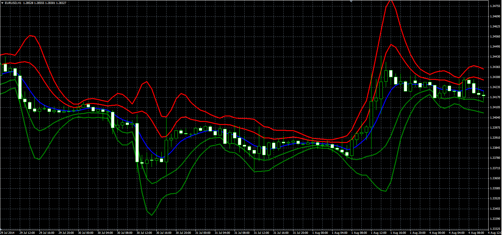

# Gaussian Bands

> Source: https://fxcodebase.com/code/viewtopic.php?f=38&t=61231  
> Forum: 38 · Topic 61231 · 1 post(s)

---

## Gaussian Bands

**Alexander.Gettinger** · Tue Sep 23, 2014 10:30 am

Original LUA indicator: [viewtopic.php?f=17&t=27847&p=48828](https://fxcodebase.com/code/viewtopic.php?f=17&t=27847&p=48828).

> Works nearly the same as the original bollinger band, but with following features:
> Gaussian Filtration for centerline;
> Gaussian Filtration for stDev

 

Download:

 [GB.mq4](files/96125/GB.mq4)
