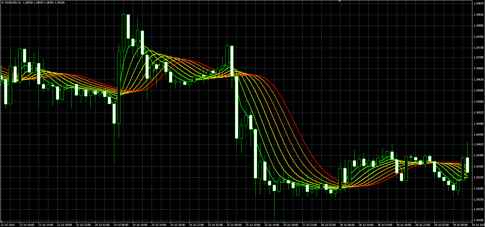

# Gaussian Rainbow

> Source: https://fxcodebase.com/code/viewtopic.php?f=38&t=61232  
> Forum: 38 · Topic 61232 · 1 post(s)

---

## Gaussian Rainbow

**Alexander.Gettinger** · Tue Sep 23, 2014 10:32 am

Original LUA indicator: [viewtopic.php?f=17&t=27846](https://fxcodebase.com/code/viewtopic.php?f=17&t=27846).

> This indiactor uses gaussian filtration to get the first filter line,
> the additional lines are calculated by refiltration of the last filter line.
> Use it for spotting trends, sideway markets and retracement zones

 

Download:

 [GR.mq4](files/96127/GR.mq4)
