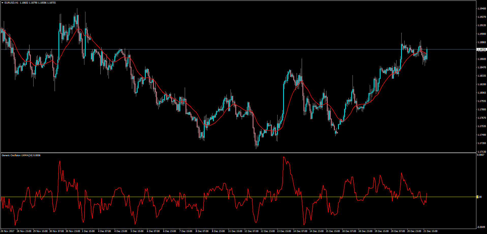

# Generic Oscillator

> Source: https://fxcodebase.com/code/viewtopic.php?f=38&t=65482  
> Forum: 38 · Topic 65482 · 1 post(s)

---

## Generic Oscillator

**Apprentice** · Tue Dec 26, 2017 5:56 am

LUA Original:
[viewtopic.php?f=17&t=3337](https://fxcodebase.com/code/viewtopic.php?f=17&t=3337)
Description:
This is the MT4 version of the LUA original "Generic Oscillator" which displays the difference between price (close) and any of the available 17 moving averages.

 [Generic_Oscillator.mq4](files/116628/Generic_Oscillator.mq4)
