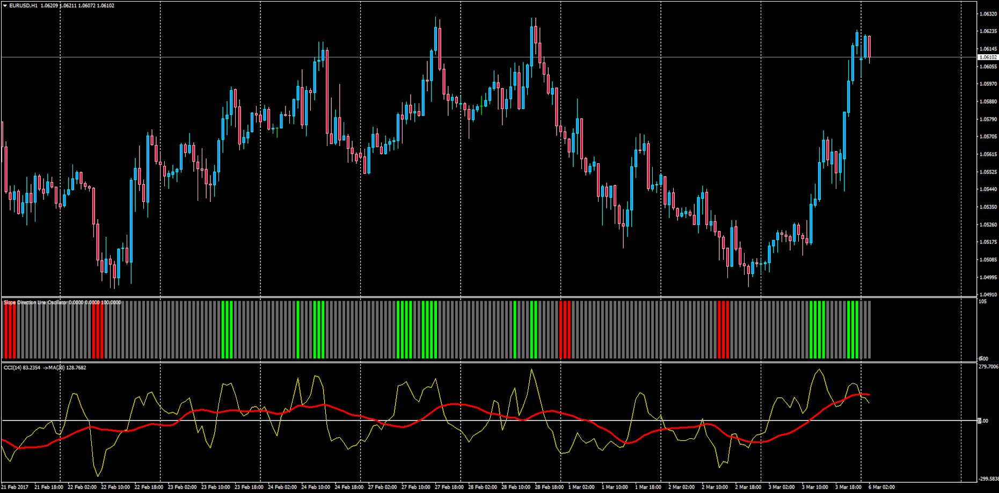

# Generic Overlay Bar Histogram

> Source: https://fxcodebase.com/code/viewtopic.php?f=38&t=64503  
> Forum: 38 · Topic 64503 · 1 post(s)

---

## Generic Overlay Bar Histogram

**Apprentice** · Mon Mar 06, 2017 4:57 am

Description:

This is the MT4 version of the LUA Original Generic Overlay Histogram. This version covers the following oscillators: RSI, Stochastic, CCI, Ultimate Oscillator, MACD and Williams Percent.

Analysis methods:

- Positive/Negative Slope
- Above/Below Level (Center Line or custom)
- Above OB Level and Below OS Level
- Above/Below Moving Average (n Periods) of the Oscillator

 [Generic_Overlay_Bar_Histogram.mq4](files/111337/Generic_Overlay_Bar_Histogram.mq4)

Note: The Ultimate Oscillator requires to have this indicator installed in the Indicators folder: [viewtopic.php?f=38&t=64482](https://fxcodebase.com/code/viewtopic.php?f=38&t=64482)
