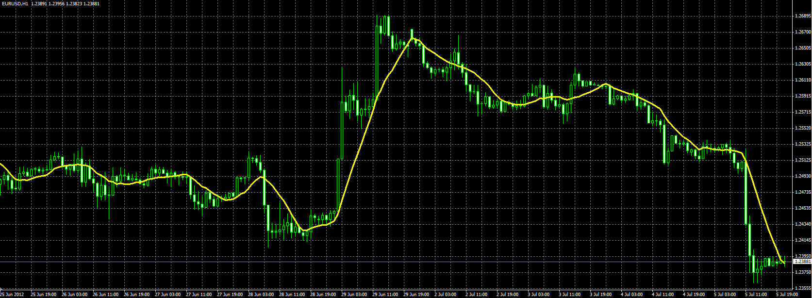

# Geometric Mean moving average

> Source: https://fxcodebase.com/code/viewtopic.php?f=38&t=20877  
> Forum: 38 · Topic 20877 · 5 post(s)

---

## Geometric Mean moving average

**Alexander.Gettinger** · Thu Jul 05, 2012 5:05 pm

Formula:
GeoMeanMA[i]=(Price[i]*Price[i-1]*…*Price[i-N+1])^(1/N).

 

Download:

 [GeoMin_MA.mq4](files/36566/GeoMin_MA.mq4)

---

## Re: Geometric Mean moving average

**Gilles** · Mon Mar 13, 2023 1:08 pm

Hi Alexander, Apprentice,

Please a LUA version.
Thank you :) !

---

## Re: Geometric Mean moving average

**Gilles** · Mon Mar 13, 2023 2:05 pm

Hi Apprentice,

I worked on my own and I'm sharing my version of the geometric mean for FX Trading Station.
[attachment=0]GMA.lua[/attachment]

---

## Re: Geometric Mean moving average

**Apprentice** · Tue Mar 14, 2023 3:07 pm

Any help is welcome,
as I have quite a stressful period in my life.

Moving into a New apartment, having a new baby, and working on a new degree...

---

## Re: Geometric Mean moving average

**Gilles** · Thu Mar 16, 2023 2:48 am

Hi Apprentice,
I wish you and your family all the best :)!
This is such a happy event :)!!!
I understand why you're short on time :)!
