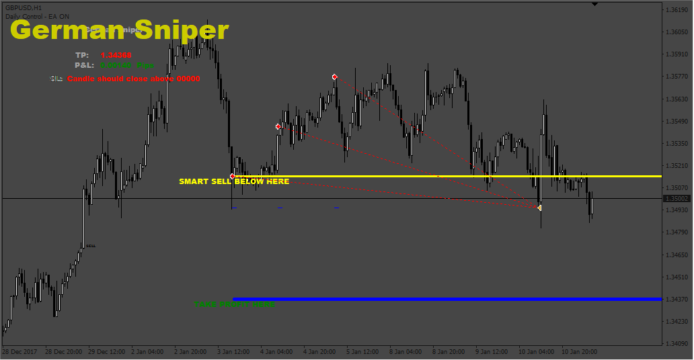
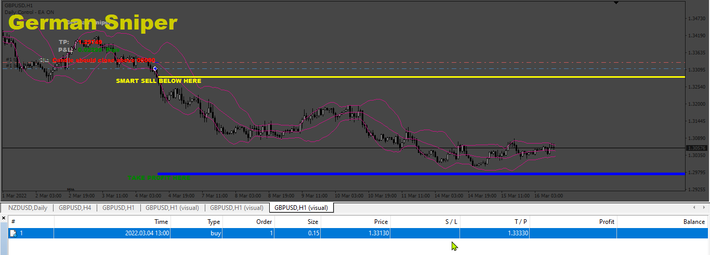
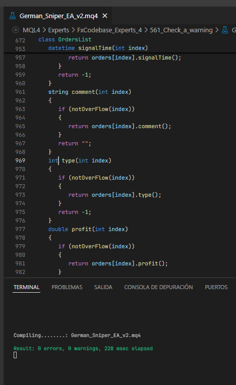
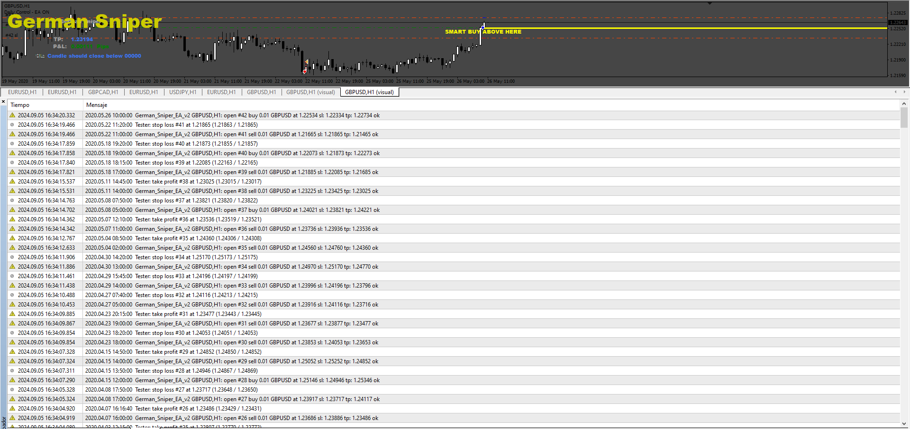
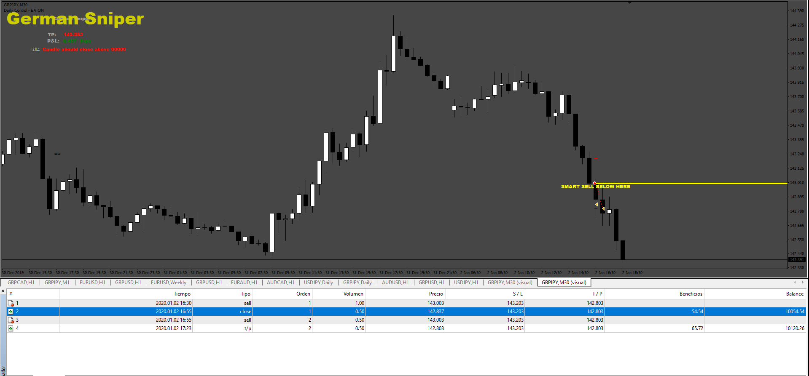

# German_Sniper EA

> Source: https://fxcodebase.com/code/viewtopic.php?f=38&t=73454  
> Forum: 38 · Topic 73454 · 24 post(s)

---

## German_Sniper EA

**Apprentice** · Sun Mar 05, 2023 6:06 pm

Based on the request.
[https://fxcodebase.com/code/viewtopic.php?f=27&p=149677](https://fxcodebase.com/code/viewtopic.php?f=27&p=149677)

 [German Sniper Indicator V1.ex4](files/149872/German%20Sniper%20Indicator%20V1.ex4)

 [German_Sniper EA.mq4](files/149872/German_Sniper%20EA.mq4)

---

## Re: German_Sniper EA

**kkforex** · Fri Apr 07, 2023 8:59 am

Thank you for this EA based on German sniper.
I am testing it but when the Close on opposite signal setting is made, its stopping an showing error.
Can you fix it?

---

## Re: German_Sniper EA

**Apprentice** · Wed Apr 12, 2023 3:46 am

We have added your request to the development list.
Development reference 323.

---

## Re: German_Sniper EA

**Apprentice** · Sat Apr 15, 2023 5:09 am

Fixed.

---

## Re: German_Sniper EA

**kkforex** · Sat Apr 15, 2023 9:16 pm

Thank you so much, The Close on Opposite signal works now.

---

## Re: German_Sniper EA

**murilovagner** · Wed Jun 21, 2023 10:23 pm

Hello administrator, could you not put these fibonacci lines in this code as well as this attached file. Thanks

---

## Re: German_Sniper EA

**Apprentice** · Fri Jun 23, 2023 4:34 am

How fibonacci lines will work with the EA?

We have added your request to the development list.
Development reference 564.

---

## Re: German_Sniper EA

**murilovagner** · Mon Jun 26, 2023 11:19 am

Fibonacci lines are used by thousands of traders around the world, putting them together in the code would help to identify buy or sell positions, always looking for the market trend.

---

## Re: German_Sniper EA

**rickCreations** · Thu Jun 29, 2023 2:21 pm

Is it possible to get the .mq4 of the indicator also

---

## Re: German_Sniper EA

**Apprentice** · Sat Jul 01, 2023 5:58 am

We only have EX4 version of German Sniper Indicator

---

## Re: German_Sniper EA

**murilovagner** · Wed Sep 20, 2023 11:36 am

> **rickCreations wrote:**
> Is it possible to get the .mq4 of the indicator also

---

## Re: German_Sniper EA

**Hermes** · Mon Mar 11, 2024 4:46 am

Hello and thanks for making this expert
But it doesn't work for me
I am attaching its errors
If possible, fix it
Many thanks

---

## Re: German_Sniper EA

**Apprentice** · Mon Mar 11, 2024 11:53 am

We have added your request to the development list.
Development reference 216

---

## Re: German_Sniper EA

**Apprentice** · Sat Mar 16, 2024 1:58 pm

 [German_Sniper_EA_v2.mq4](files/154704/German_Sniper_EA_v2.mq4)

---

## Re: German_Sniper EA

**rahulburde638** · Fri Jun 14, 2024 7:38 am

> **kkforex wrote:**
> Thank you so much, The Close on Opposite signal works now.

 Can you please share the EA?

---

## Re: German_Sniper EA

**Morgan02** · Wed Jul 10, 2024 11:02 pm

Hi Admin

Please assist.

I recently added this to my micro account and I am getting no 0 errors on meta-editor, however I am getting this warning on line 971 Colum 41. Implicit enum conversion

ENUM_ORDER_TYPE type(int index)
 {
 if (notOverFlow(index))
 {
 return orders[index].type();
 }
 return -1;
 }

Please assist with a possible solution.

Thank you.

Kind regards

Morgan02

---

## Re: German_Sniper EA

**Apprentice** · Sat Jul 13, 2024 1:52 am

We have added your request to the development list.
Development reference 561

---

## Re: German_Sniper EA

**Apprentice** · Tue Jul 30, 2024 3:37 pm

 [German_Sniper_EA_v2.mq4](files/156270/German_Sniper_EA_v2.mq4)

---

## Re: German_Sniper EA

**sasha001** · Tue Aug 20, 2024 2:28 am

2024.08.20 09:46:21.227	2024.07.22 05:00:00 German_Sniper_EA_v2 AUDJPY,M5: OrdersList::closeAllInList Error in close order 4: 4108

---

## Re: German_Sniper EA

**Apprentice** · Wed Aug 21, 2024 4:25 pm

We have added your request to the development list.
Development reference 667

---

## Re: German_Sniper EA

**Apprentice** · Tue Sep 10, 2024 11:54 am

 [German_Sniper_EA_v2.mq4](files/156649/German_Sniper_EA_v2.mq4)

---

## Re: German_Sniper EA

**Karimrjh** · Mon Oct 21, 2024 3:03 pm

Is it possible to add Partials? If a trade goes moves up for example 50% if the take profit it takes partial which can be choosen indiviually. Thank you

---

## Re: German_Sniper EA

**Apprentice** · Thu Oct 31, 2024 8:50 am

We have added your request to the development list.
Development reference 824

---

## Re: German_Sniper EA

**Apprentice** · Mon Nov 04, 2024 4:33 am

 [German_Sniper_EA_v3.mq4](files/157163/German_Sniper_EA_v3.mq4)
