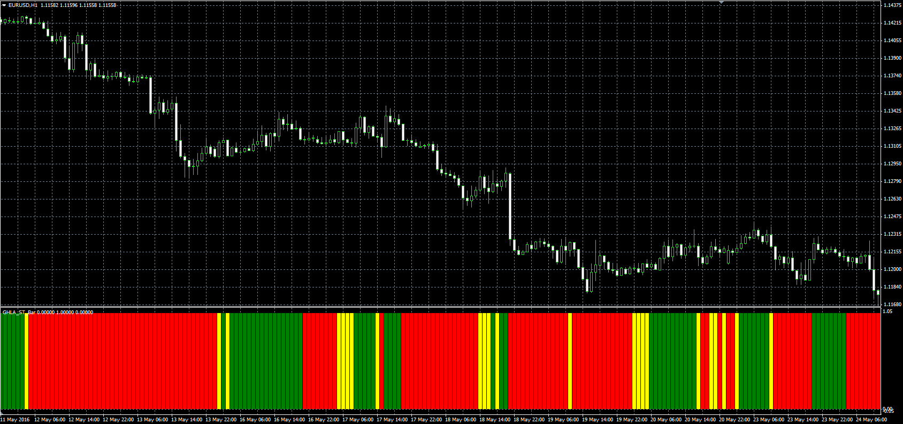

# GHLA Super Trend Bar

> Source: https://fxcodebase.com/code/viewtopic.php?f=38&t=63523  
> Forum: 38 · Topic 63523 · 1 post(s)

---

## GHLA Super Trend Bar

**Alexander.Gettinger** · Tue May 24, 2016 11:05 am

This indicator is a combination of two indicators: Gann HiLo Activator ([viewtopic.php?f=38&t=63522](https://fxcodebase.com/code/viewtopic.php?f=38&t=63522)) and Super trend indicator ([viewtopic.php?f=38&t=63520](https://fxcodebase.com/code/viewtopic.php?f=38&t=63520)).

The indicator shows up trend, if price>ST and price>GHLA, down trend, if price<ST and price<GHLA and no trend in another cases.

 

Download:

 [GHLA_ST_Bar.mq4](files/106454/GHLA_ST_Bar.mq4)
