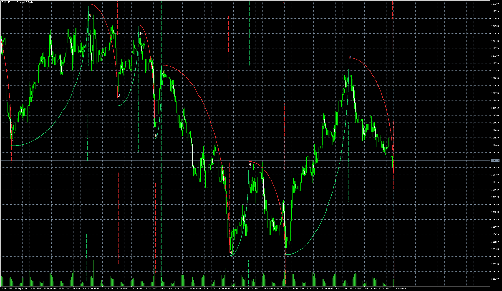

# Ghost_Tangent_Crossings_5D

> Source: https://fxcodebase.com/code/viewtopic.php?f=38&t=76385  
> Forum: 38 · Topic 76385 · 6 post(s)

---

## Ghost_Tangent_Crossings_5D

**Apprentice** · Tue Oct 21, 2025 1:51 am

Based on the request.
[https://fxcodebase.com/code/viewtopic.p ... q5#p159038](https://fxcodebase.com/code/viewtopic.php?f=27&t=75858&p=159038&hilit=please+convert+this+tradingview+indicator+to+mq5#p159038)

 [Ghost_Tangent_Crossings_5D.mq5](files/160960/Ghost_Tangent_Crossings_5D.mq5)

---

## Re: Ghost_Tangent_Crossings_5D

**khanatd** · Mon Nov 10, 2025 12:18 am

Hi sir , is mq4 version available? thanks

---

## Re: Ghost_Tangent_Crossings_5D

**Apprentice** · Sun Nov 16, 2025 3:23 pm

We have added your request to the development list.
Development reference 737

---

## Re: Ghost_Tangent_Crossings_5D

**garry119** · Fri Nov 21, 2025 4:57 am

Could a respected coder please make this indicator for MT4?

---

## Re: Ghost_Tangent_Crossings_5D

**Apprentice** · Mon Nov 24, 2025 1:50 pm

 [Ghost_Tangent_Crossings.mq4](files/161301/Ghost_Tangent_Crossings.mq4)

---

## Re: Ghost_Tangent_Crossings_5D

**Mahadeo1806** · Mon Jan 19, 2026 10:19 pm

Its repaint
