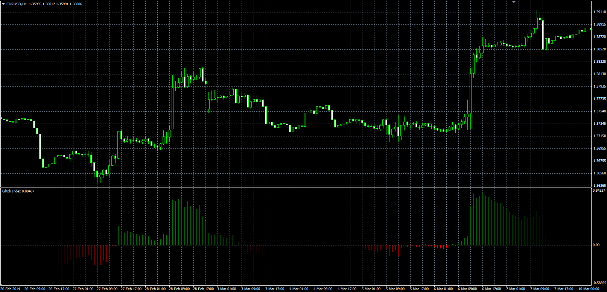

# Glitch Index

> Source: https://fxcodebase.com/code/viewtopic.php?f=38&t=60770  
> Forum: 38 · Topic 60770 · 1 post(s)

---

## Glitch Index

**Alexander.Gettinger** · Wed Jun 04, 2014 5:23 pm

Original LUA oscillator: [viewtopic.php?f=17&t=60078](https://fxcodebase.com/code/viewtopic.php?f=17&t=60078).

Formulas:
Glitch Index[i] = 100*diff[i]/Price[i], where
diff[i] = Price[i] - smamult[i],
smamult[i] = MA(i)*((MA(i)-MA(i-ROC_Length))*0.1+1),
MA - moving average with [MA_Length] and [MA_Method].

 

Download:

 [Glitch_Index.mq4](files/94308/Glitch_Index.mq4)
