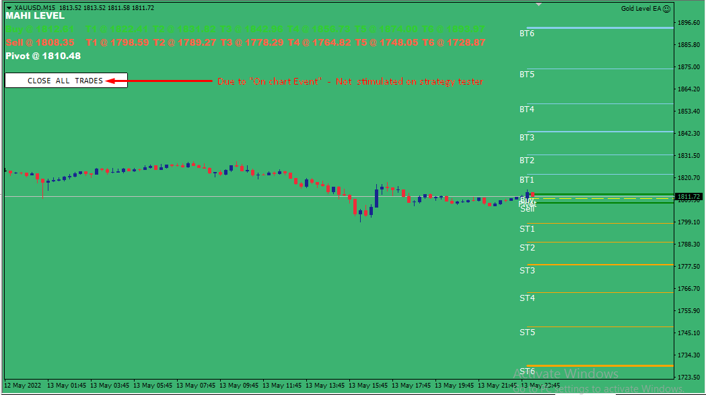
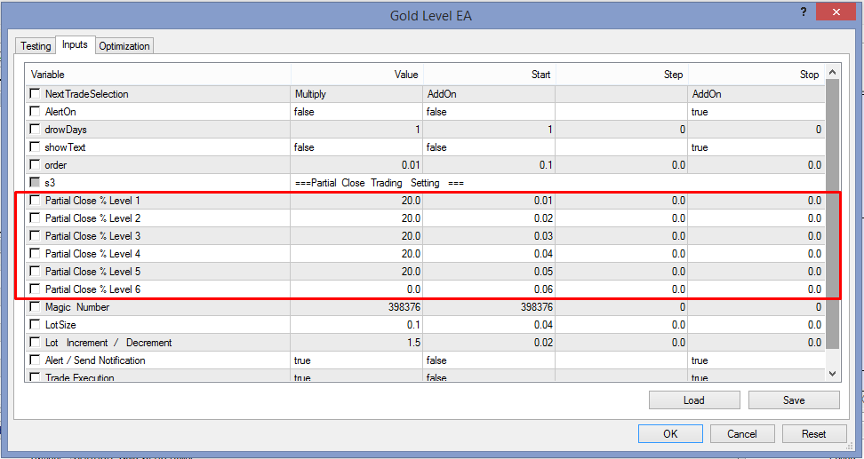
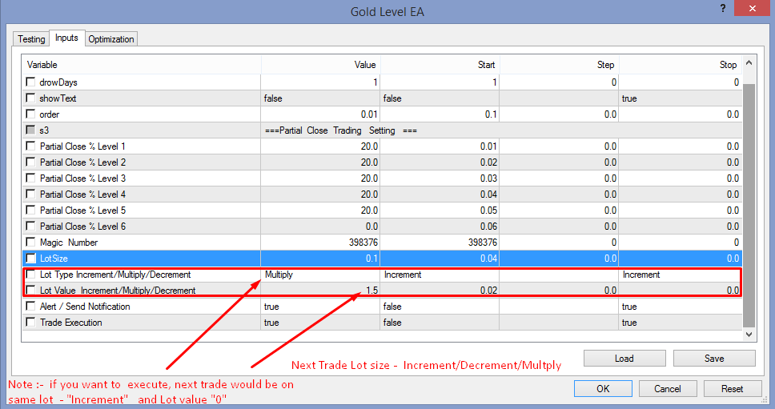
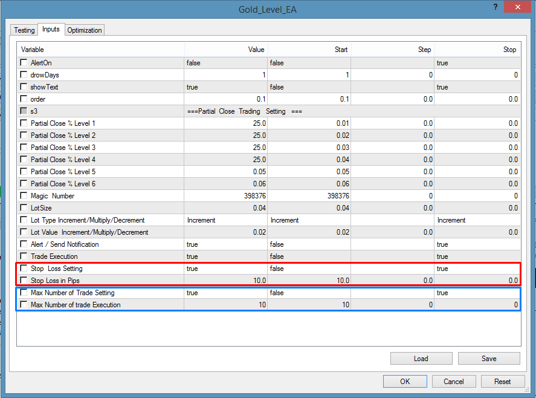
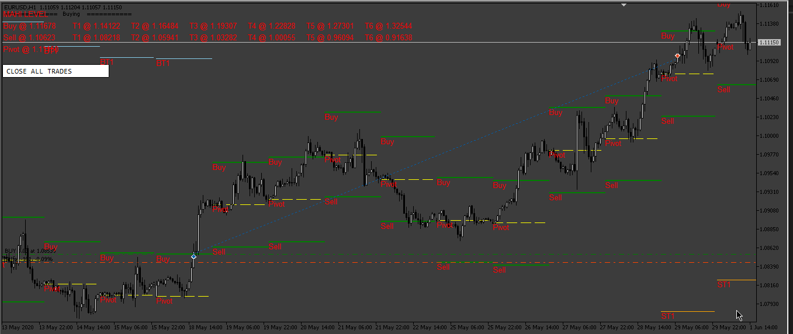
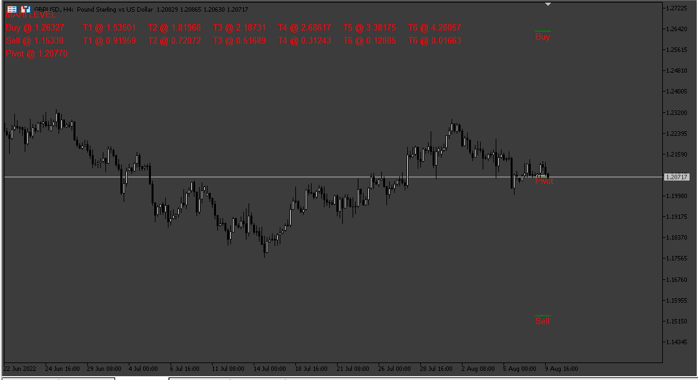

# Gold_Level_EA

> Source: https://fxcodebase.com/code/viewtopic.php?f=38&t=72138  
> Forum: 38 · Topic 72138 · 15 post(s)

---

## Gold_Level_EA

**Apprentice** · Mon May 02, 2022 8:53 am

Make Sure : Use New Indicator , As I attached , I have updated on indicator as well

 [GOLD_LEVEL.mq4](files/145874/GOLD_LEVEL.mq4)

 [Gold_Level_EA.mq4](files/145874/Gold_Level_EA.mq4)

---

## Re: Gold_Level_EA

**Gambit** · Wed May 04, 2022 2:26 am

Hi

- On backtest, the button or text "close all trades" dosen´t work.
- The "drowdays" section dosen´t work, set it to draw several numbers for days but nothing happens.
- The "multiply" section I don´t understand the logic, as in backtest it dosen´t show anything.
- On the screenshot I sent, the bot does the partial close at the open of the trade and not on the partial levels.
- On partial close setting is better if you have % to close option, 25%-50%-75%-100%. So on all 6 levels you have dose 4 options.

Regards

---

## Re: Gold_Level_EA

**Apprentice** · Fri May 06, 2022 5:26 am

We have added your request to the development list.
Development reference 281.

---

## Re: Gold_Level_EA

**Apprentice** · Wed May 18, 2022 9:15 am

 

 

Make sure to re-download the EA file.

---

## Re: Gold_Level_EA

**rafiksmith** · Fri Jul 01, 2022 7:43 am

Hi
can you add stop loss and max opened trade?

---

## Re: Gold_Level_EA

**Apprentice** · Sun Jul 03, 2022 4:58 am

We have added your request to the development list.
Development reference 399.

---

## Re: Gold_Level_EA

**Apprentice** · Mon Jul 25, 2022 4:30 am

 [GOLD_LEVEL.mq4](files/146876/GOLD_LEVEL.mq4)

 [Gold_Level_EA.mq4](files/146876/Gold_Level_EA.mq4)

---

## Re: Gold_Level_EA

**rafiksmith** · Mon Aug 01, 2022 1:27 am

Thank you, How can i adjust take profit levels without modifying the buy & sell levels?

---

## Re: Gold_Level_EA

**Apprentice** · Tue Aug 02, 2022 4:42 am

We have added your request to the development list.
Development reference 453.

---

## Re: Gold_Level_EA

**logicgate** · Thu Aug 04, 2022 6:35 pm

Can we get this for MT5?

The optimization algorithm is better, and we can use the Cloud feature too to speed things up.

---

## Re: Gold_Level_EA

**Apprentice** · Fri Aug 05, 2022 2:00 am

We have added your request to the development list.
Development reference 468

---

## Re: Gold_Level_EA

**Apprentice** · Wed Aug 17, 2022 2:05 am

 

 [Gold_Level_mt5.mq5](files/147120/Gold_Level_mt5.mq5)

 [Gold_Level_mt5_EA.mq5](files/147120/Gold_Level_mt5_EA.mq5)

---

## Re: Gold_Level_EA

**logicgate** · Wed Aug 17, 2022 4:06 pm

Brilliant, thanks buddy!

---

## Re: Gold_Level_EA

**logicgate** · Fri Aug 19, 2022 8:28 am

I am running optmization but I am get very bad results.

How does the EA work?

I don´t get why so many partial close levels, can´t it just have one TP and SL?

---

## Re: Gold_Level_EA

**Apprentice** · Thu Jan 23, 2025 5:10 pm

Yes, you can.
