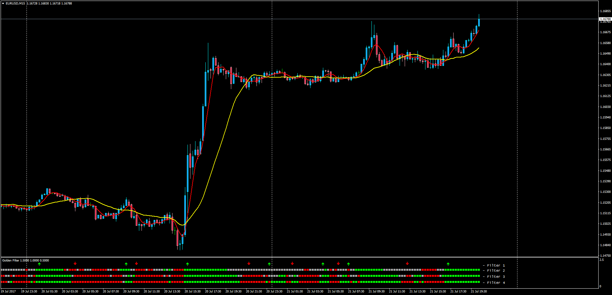

# Golden Filter

> Source: https://fxcodebase.com/code/viewtopic.php?f=38&t=64941  
> Forum: 38 · Topic 64941 · 1 post(s)

---

## Golden Filter

**Apprentice** · Sat Jul 22, 2017 8:31 am

LUA Original: [viewtopic.php?f=17&t=27295](https://fxcodebase.com/code/viewtopic.php?f=17&t=27295)

Description:

This is the MT4 version of the LUA Original Golden Filter:

Line 1
Long
ShortMA / LongMA CrossOver
Short
ShortMA / LongMA CrossUnder

Line 2
Long
MACD > SIGNAL
DIP > DIM
RSI > 50
Short
MACD < SIGNAL
DIP < DIM
RSI < 50

Line 3
Long
Force Index > 0
DeMarker > 0.5
Short
Force Index < 0
DeMarker < 0.5

Line 4
Long
Momentum > 100
Short
Momentum < 100

 [GoldenFilter.mq4](files/113698/GoldenFilter.mq4)
