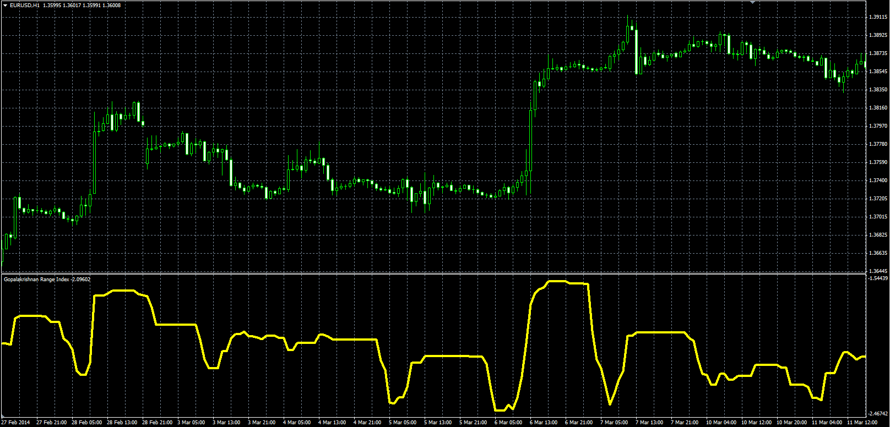

# Gopalakrishnan Range Index

> Source: https://fxcodebase.com/code/viewtopic.php?f=38&t=60768  
> Forum: 38 · Topic 60768 · 1 post(s)

---

## Gopalakrishnan Range Index

**Alexander.Gettinger** · Wed Jun 04, 2014 1:16 pm

Original LUA oscillator: [viewtopic.php?f=17&t=60132](https://fxcodebase.com/code/viewtopic.php?f=17&t=60132).

Formulas:
GAPO[i] = Log(Max-Min)/Log(Length), where
Log - logarithm,
Max, Min - maximum and minimum prices at the range from (i-Length+1) to (i).

 

Download:

 [GAPO.mq4](files/94305/GAPO.mq4)
