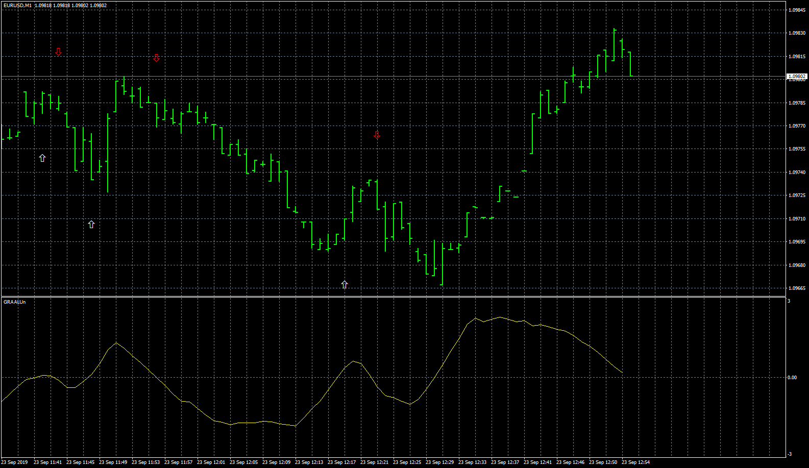

# GRAALUn_Ar

> Source: https://fxcodebase.com/code/viewtopic.php?f=38&t=68998  
> Forum: 38 · Topic 68998 · 18 post(s)

---

## GRAALUn_Ar

**Apprentice** · Wed Oct 09, 2019 1:42 pm

Based on request.
[viewtopic.php?f=27&t=68977](https://fxcodebase.com/code/viewtopic.php?f=27&t=68977)

 [GRAALUn_Ar.mq4](files/129078/GRAALUn_Ar.mq4)

 [GRAALUn_Ar.mq5](files/129078/GRAALUn_Ar.mq5)

---

## Re: GRAALUn_Ar

**planstyr** · Wed Oct 09, 2019 2:27 pm

> **Apprentice wrote:**
>
>
> eurusd-m1-fxcm-australia-pty-3.png
>
>
> Based on request.
> [viewtopic.php?f=27&t=68977](https://fxcodebase.com/code/viewtopic.php?f=27&t=68977)
>
>
> GRAALUn_Ar.mq4

wow, thank you !!!

---

## Re: GRAALUn_Ar

**planstyr** · Wed Oct 09, 2019 3:04 pm

> **Apprentice wrote:**
>
>
> eurusd-m1-fxcm-australia-pty-3.png
>
>
> Based on request.
> [viewtopic.php?f=27&t=68977](https://fxcodebase.com/code/viewtopic.php?f=27&t=68977)
>
>
> GRAALUn_Ar.mq4

**Apprentice** Just tested. And it Repaints!

Can you fix it?

---

## Re: GRAALUn_Ar

**planstyr** · Wed Oct 09, 2019 3:07 pm

Just tested. It repaint. Can you fix it?

---

## Re: GRAALUn_Ar

**Apprentice** · Thu Oct 10, 2019 12:23 pm

I can add one candle delay. Will this suffice?

---

## Re: GRAALUn_Ar

**planstyr** · Thu Oct 10, 2019 12:41 pm

> **Apprentice wrote:**
> I can add one candle delay. Will this suffice?

Yes.
The main thing is not to redraw.

---

## Re: GRAALUn_Ar

**sahaeta** · Thu Aug 20, 2020 5:02 am

can modification arrow level , buy arrow 0.3 sell -03. And Multi time frame ! Thanks

---

## Re: GRAALUn_Ar

**Apprentice** · Thu Aug 20, 2020 6:13 am

Your request is added to the development list.
Development reference 1911.

---

## Re: GRAALUn_Ar

**sahaeta** · Thu Aug 20, 2020 7:14 am

thank you

---

## Re: GRAALUn_Ar

**Apprentice** · Tue Sep 08, 2020 4:21 am

[GRAALUn_Ar.mq4](files/137431/GRAALUn_Ar.mq4)

Try this version.

---

## Re: GRAALUn_Ar

**963Success369** · Wed Nov 03, 2021 4:10 am

Mario thank you so much!!!

I sent you donation for this indicator!!!

God bless u!

---

## Re: GRAALUn_Ar

**helloktity** · Fri Dec 23, 2022 11:39 am

> **Apprentice wrote:**
>
>
> eurusd-m1-fxcm-australia-pty-3.png
>
>
> Based on request.
> [viewtopic.php?f=27&t=68977](https://fxcodebase.com/code/viewtopic.php?f=27&t=68977)
>
>
> GRAALUn_Ar.mq4

i need mt5 version thanks

---

## Re: GRAALUn_Ar

**Apprentice** · Sat Dec 24, 2022 4:36 am

We have added your request to the development list.
Development reference 854.

---

## Re: GRAALUn_Ar

**helloktity** · Thu Dec 29, 2022 4:55 am

> **Apprentice wrote:**
>
>
> The attachment **eurusd-m1-fxcm-australia-pty-3.png** is no longer available
>
>
> Based on request.
> [viewtopic.php?f=27&t=68977](https://fxcodebase.com/code/viewtopic.php?f=27&t=68977)
>
>
> The attachment **eurusd-m1-fxcm-australia-pty-3.png** is no longer available

The indicator will still repaint

---

## Re: GRAALUn_Ar

**Apprentice** · Fri Dec 30, 2022 4:14 am

We have added your request to the development list.
Development reference 865.

---

## Re: GRAALUn_Ar

**helloktity** · Fri Dec 30, 2022 4:16 am

> **helloktity wrote:**
>
>
> > **Apprentice wrote:**
> >
> >
> > eurusd-m1-fxcm-australia-pty-3.png
> >
> >
> > Based on request.
> > [viewtopic.php?f=27&t=68977](https://fxcodebase.com/code/viewtopic.php?f=27&t=68977)
> >
> >
> > GRAALUn_Ar.mq4
>
>
>
> The indicator will still repaint

Unfortunately, this indicator will still be redrawn, as shown in the figure below, the basic arrow will go back 2-3 bars, and the original arrow will disappear when you switch the chart period, the figure below is that the period has not been switched , you can see a lot of arrows.
It would be better if the indicator could record the first position of the arrow before repainting, thanks!

---

## Re: GRAALUn_Ar

**Apprentice** · Mon Jan 09, 2023 10:07 am

GRAALUn_Ar.mq5 added.

---

## Re: GRAALUn_Ar

**Apprentice** · Mon Jan 09, 2023 10:20 am

Task 865

 [GRAALUn_Ar.mq4](files/148983/GRAALUn_Ar.mq4)
