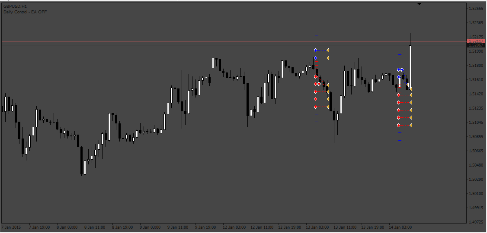

# Grid_Based_EA

> Source: https://fxcodebase.com/code/viewtopic.php?f=38&t=73689  
> Forum: 38 · Topic 73689 · 2 post(s)

---

## Grid_Based_EA

**Apprentice** · Sun May 07, 2023 3:30 am

Based on the request.
[https://fxcodebase.com/code/viewtopic.php?f=38&t=73653](https://fxcodebase.com/code/viewtopic.php?f=38&t=73653)

 [Grid_Based_EA.mq4](files/150726/Grid_Based_EA.mq4)

---

## Re: Grid_Based_EA

**alizon** · Mon May 06, 2024 9:54 am

Can you add an open order by money distance feature -$5 from total equity?

So to the Pips between Orders which was By Pips added By Money Minus (-$5)

Open Order Mode Averaging: By Pips/By Money Minus
By Pips : 50
By Money Minus: 5

Thank You.
