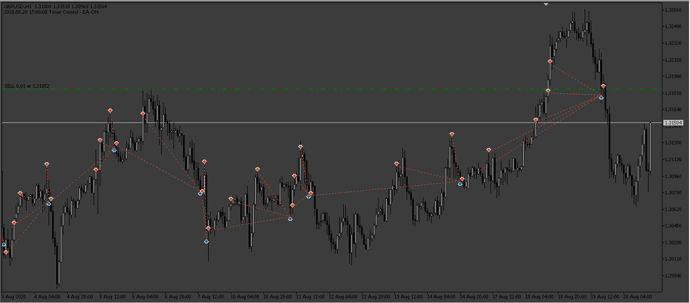
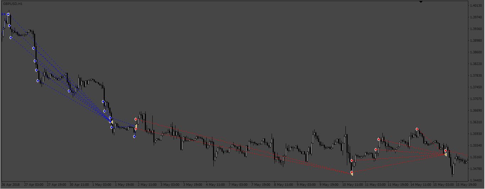

# Grid_BaseOnManualTrade

> Source: https://fxcodebase.com/code/viewtopic.php?f=38&t=73249  
> Forum: 38 · Topic 73249 · 11 post(s)

---

## Grid_BaseOnManualTrade

**Apprentice** · Fri Jan 20, 2023 11:03 am

Based on the request.
[https://fxcodebase.com/code/viewtopic.php?f=27&p=149092](https://fxcodebase.com/code/viewtopic.php?f=27&p=149092)

 

 [Grid_BaseOnManualTrade_v1.10.mq4](files/149187/Grid_BaseOnManualTrade_v1.10.mq4)

 [Grid_BaseOnManualTrade_v1.10.mq5](files/149187/Grid_BaseOnManualTrade_v1.10.mq5)

---

## Re: Grid_BaseOnManualTrade

**lotto68** · Thu Mar 02, 2023 8:02 am

Tks for your file mq5, but can you make a *.mq4 *.ex4 files please. I still use mt4 desktop version.
Once again, tks you so much!

---

## Re: Grid_BaseOnManualTrade

**Apprentice** · Thu Mar 02, 2023 8:49 am

We have added your request to the development list.
Development reference 211.

---

## Re: Grid_BaseOnManualTrade

**Apprentice** · Sat Mar 11, 2023 3:36 am

Grid_Based_on_manual_trade.mq4 added.

---

## Re: Grid_BaseOnManualTrade

**lotto68** · Sat Mar 11, 2023 3:37 pm

> **Apprentice wrote:**
> Grid_Based_on_manual_trade.mq4 added.

Tks u so much! I'll try it for next week.

---

## Re: Grid_BaseOnManualTrade

**[email protected]** · Thu Aug 14, 2025 3:54 am

> **Apprentice wrote:**
>
>
> 41pic2.png
>
>
> Based on the request.
> [https://fxcodebase.com/code/viewtopic.php?f=27&p=149092](https://fxcodebase.com/code/viewtopic.php?f=27&p=149092)
>
>
> Grid_BaseOnManualTrade.mq5
>
>
>
>
> 211pic.png
>
>
>
>
> Grid_Based_on_manual_trade.mq4

Hi. Please make a change in these EA and create new Version for these Experts (MT4 and MT5).
In the new Version EA will open grid position in the in two directions according to price movements. Regardless of whether the initial position is buy or sell, if the price moves higher than the initial position, the grid EA opens buy positions at the specified intervals, and if the price moves lower than the initial price, the grid EA opens sell positions at the specified intervals.
Also please add spread filter.
Thanks in advance.

---

## Re: Grid_BaseOnManualTrade

**Apprentice** · Mon Aug 18, 2025 7:15 am

We have added your request to the development list.
Development reference 522

---

## Re: Grid_BaseOnManualTrade

**Apprentice** · Mon Aug 25, 2025 3:17 am

[Double_Grid_Based_on_manual_trade.mq4](files/160341/Double_Grid_Based_on_manual_trade.mq4)

 [Double_Grid_BaseOnManualTrade.mq5](files/160341/Double_Grid_BaseOnManualTrade.mq5)

---

## Re: Grid_BaseOnManualTrade

**[email protected]** · Tue Aug 26, 2025 7:06 am

> **Apprentice wrote:**
>
>
> The attachment **Double_Grid_Based_on_manual_trade.mq4** is no longer available
>
>
>
>
> The attachment **Double_Grid_Based_on_manual_trade.mq4** is no longer available

Hi. thanks for your great work. I tested the EA and it does not act as i described.
The Expert Advisor opens buy and sell positions at the same price, which is wrong. The strategy is that if the price is higher than the trader's opened position, the Grid Strategy opens only buy positions at certain intervals, and if the price is lower than the trader's opened position, the Grid Strategy opens only sell positions at certain intervals. That is, the trader's position determines the boundary between buy (higher price) and sell (lower price) positions. also the distance between the grids are wrong in some cases. The correct form of opening a position by the Expert Advisor is shown in the figure.
Also please add select Pip/ Point mode for grids and spread filter in input data.

Thanks in advance.

---

## Re: Grid_BaseOnManualTrade

**Apprentice** · Wed Aug 27, 2025 11:20 am

We have added your request to the development list.
Development reference 545

---

## Re: Grid_BaseOnManualTrade

**Apprentice** · Mon Sep 08, 2025 3:46 am

[Grid_BaseOnManualTrade_v1.10.mq4](files/160488/Grid_BaseOnManualTrade_v1.10.mq4)

 [Grid_BaseOnManualTrade_v1.10.mq5](files/160488/Grid_BaseOnManualTrade_v1.10.mq5)
