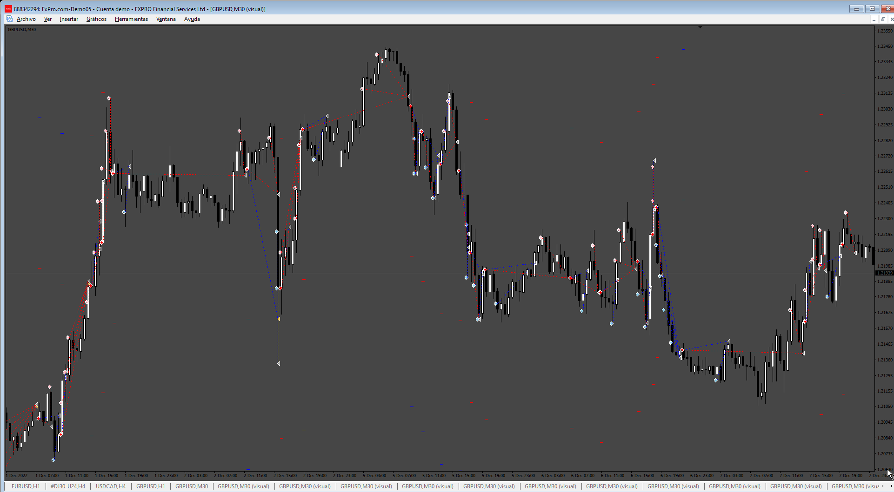
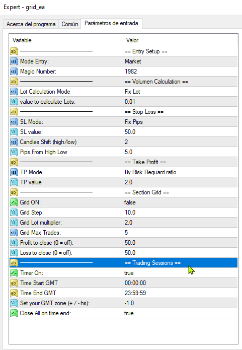

# grid_ea

> Source: https://fxcodebase.com/code/viewtopic.php?f=38&t=75108  
> Forum: 38 · Topic 75108 · 4 post(s)

---

## grid_ea

**Apprentice** · Tue Jul 30, 2024 4:54 pm

Based on the request.
[https://fxcodebase.com/code/viewtopic.php?f=38&t=75085](https://fxcodebase.com/code/viewtopic.php?f=38&t=75085)

 [grid_ea.mq4](files/156280/grid_ea.mq4)

---

## Re: grid_ea

**stesuc** · Wed Jul 31, 2024 12:23 am

> **Apprentice wrote:**
>
>
> 603.png
>
>
> Based on the request.
> [https://fxcodebase.com/code/viewtopic.php?f=38&t=75085](https://fxcodebase.com/code/viewtopic.php?f=38&t=75085)
>
>
> grid_ea.mq4

 mr apprentice

countr trader filter no fungsion , add Start time open , stop times open , Time Close All

we try now
 thanks mr apprentice

---

## Re: grid_ea

**Apprentice** · Wed Jul 31, 2024 3:20 pm

We have added your request to the development list.
Development reference 616

---

## Re: grid_ea

**Apprentice** · Sat Aug 10, 2024 8:10 pm

 [grid_ea.mq4](files/156392/grid_ea.mq4)
