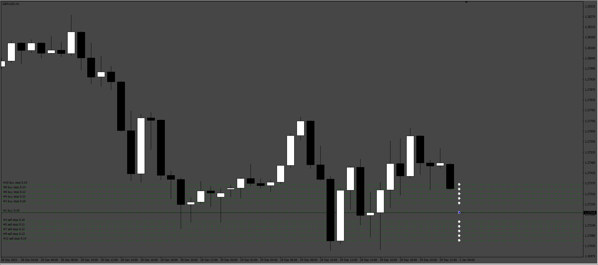
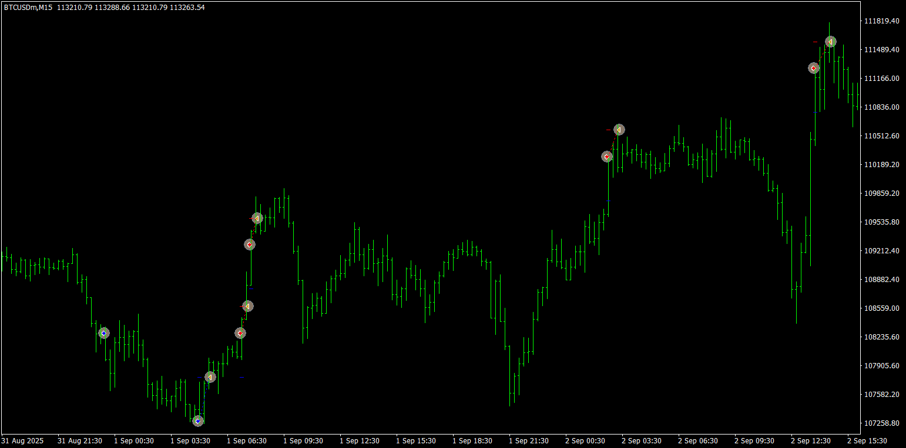
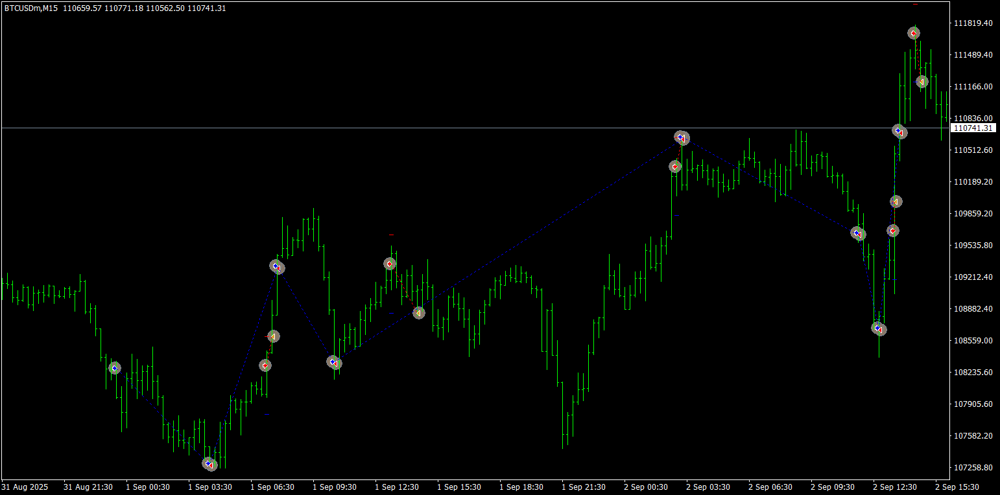

# Grid_From_Manual

> Source: https://fxcodebase.com/code/viewtopic.php?f=38&t=76238  
> Forum: 38 · Topic 76238 · 4 post(s)

---

## Grid_From_Manual

**Apprentice** · Wed Aug 13, 2025 3:53 am

Based on the request.
[https://fxcodebase.com/code/viewtopic.p ... 05#p160105](https://fxcodebase.com/code/viewtopic.php?f=27&p=160105#p160105)

 [Grid_From_Manual.mq4](files/160232/Grid_From_Manual.mq4)

---

## Re: Grid_From_Manual

**[email protected]** · Thu Aug 14, 2025 3:38 am

Hi. thanks for this EA.
In the strategy I described, the initial position must be opened by the trader or another expert, and then the expert opens grid positions according to the price movement, and in case the initial position is not opened, the expert does not take any action. But the created expert places orders (I don't want Pending orders) immediately after activation, which is wrong. The initial position signal must be issued by the trader or another expert, and then the grid expert starts working.

Also I don't want EA with Pending order. This type of order is very dangerous and risky especially during news time. Please change it and do not use pending orders. Please use normal grid and open a position just when the price moves by the distance of grid.
Please set the on/off option for TP and SL. Also set the TP and SL amount in terms of money (Deposit Currency $).
Close Grid in Profit: (On/Off)
Close grid TP: (Close by $ Profit)
Close Grid in Loss: (On/Off)
Close grid SL: (Close by $ Loss)

Also please add spread filter and start and end time filter.
Thanks in advance.

---

## Re: Grid_From_Manual

**Apprentice** · Mon Aug 18, 2025 7:16 am

We have added your request to the development list.
Development reference 523

---

## Re: Grid_From_Manual

**Apprentice** · Tue Sep 09, 2025 3:16 am

 

 [Grid_From_Manual.mq4](files/160498/Grid_From_Manual.mq4)
