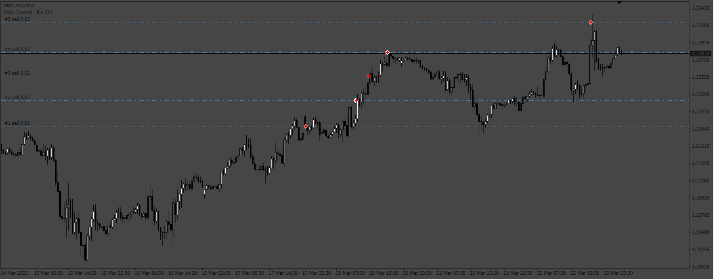
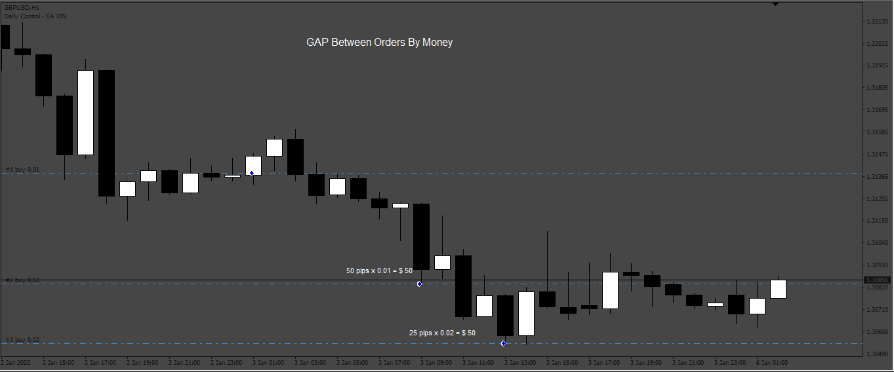

# Grid_Trading

> Source: https://fxcodebase.com/code/viewtopic.php?f=38&t=73954  
> Forum: 38 · Topic 73954 · 4 post(s)

---

## Grid_Trading

**Apprentice** · Wed Jul 19, 2023 1:39 pm

Based on the request.
[https://fxcodebase.com/code/viewtopic.php?f=38&t=72671](https://fxcodebase.com/code/viewtopic.php?f=38&t=72671)

 [Grid_Trading.mq4](files/151697/Grid_Trading.mq4)

---

## Re: Grid_Trading

**alizon** · Mon May 06, 2024 10:34 am

Sorry, I replayed the wrong post on the Grid Based post, I should have replayed this post.

I ask if you can add a Gap feature between Orders based on minus equity.

Can you add an open order by money distance feature -$5 from total equity? Total Equity is not per order.

So to the Gap Between Order which was previously By Pips added By Money Minus (-$5), applies to all pairs.

Gap Between Orders: By Pips/By Money Minus
By Pips : 50
By Money Minus: 5

Thank You.

---

## Re: Grid_Trading

**Apprentice** · Fri May 10, 2024 6:38 am

We have added your request to the development list.
Development reference 367

---

## Re: Grid_Trading

**Apprentice** · Fri May 17, 2024 12:50 pm

[40796](files/155368/367_setup.png)

 

 [Grid_Trading_v2.0.mq4](files/155368/Grid_Trading_v2.0.mq4)
