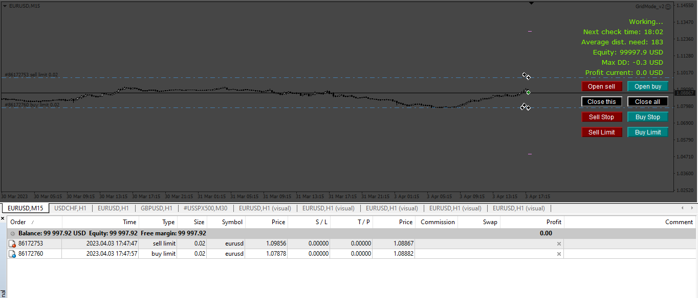

# GridMode_v2

> Source: https://fxcodebase.com/code/viewtopic.php?f=38&t=73576  
> Forum: 38 · Topic 73576 · 7 post(s)

---

## GridMode_v2

**Apprentice** · Fri Apr 07, 2023 2:12 pm

Based on the request.
[https://fxcodebase.com/code/viewtopic.php?f=38&p=150168](https://fxcodebase.com/code/viewtopic.php?f=38&p=150168)

 [GridMode_v2.mq4](files/150327/GridMode_v2.mq4)

---

## Re: GridMode_v2

**ichimokusignal** · Mon May 01, 2023 8:07 pm

I will pay, please fix how to set stoploss ea error can not set stoploss no more than 4000 points. And please combine this ea with the ichimoku indicator I asked for ([https://fxcodebase.com/code/viewtopic.php?f=27&t=73445](https://fxcodebase.com/code/viewtopic.php?f=27&t=73445)) i will pay more

---

## Re: GridMode_v2

**Apprentice** · Sun May 07, 2023 3:55 am

[GridMode_v3.mq4](files/150733/GridMode_v3.mq4)

Try it now.

---

## Re: GridMode_v2

**ichimokusignal** · Tue May 09, 2023 7:31 pm

Added the way to take profit in USD. More importantly you still haven't added the ichimoku indicator to the EA

---

## Re: GridMode_v2

**Apprentice** · Sat May 13, 2023 12:09 pm

We have added your request to the development list.
Development reference 435.

---

## Re: GridMode_v2

**ichimokusignal** · Fri Jun 23, 2023 9:29 pm

> **ichimokusignal wrote:**
> Added the way to take profit in USD. More importantly you still haven't added the ichimoku indicator to the EA

Please add space between orders

---

## Re: GridMode_v2

**Apprentice** · Mon Aug 25, 2025 3:19 am

[GridMode_v4.mq4](files/160342/GridMode_v4.mq4)
