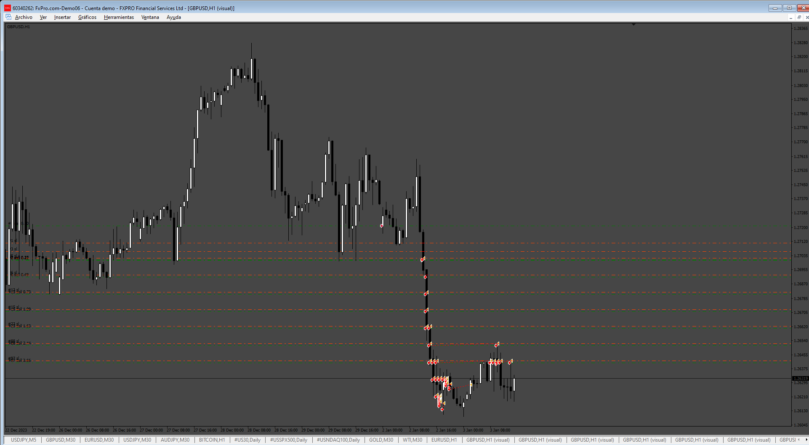

# GridRiskFreeEA

> Source: https://fxcodebase.com/code/viewtopic.php?f=38&t=76030  
> Forum: 38 · Topic 76030 · 4 post(s)

---

## GridRiskFreeEA

**Apprentice** · Fri Jun 13, 2025 3:03 am

[https://fxcodebase.com/code/viewtopic.p ... 17#p159517](https://fxcodebase.com/code/viewtopic.php?f=27&p=159517#p159517)

 [GridRiskFreeEA.mq4](files/159594/GridRiskFreeEA.mq4)

 [GridRiskFreeEA.mq5](files/159594/GridRiskFreeEA.mq5)

---

## Re: GridRiskFreeEA

**[email protected]** · Thu Jul 10, 2025 4:58 pm

> **Apprentice wrote:**
> https://fxcodebase.com/code/viewtopic.php?f=27&p=159517#p159517
>
>
> GridRiskFreeEA.mq4
>
>
>
>
> GridRiskFreeEA.mq5

Hi. thanks for your great work.
I tested the EA and observed that the distance between grids not correct( pips or points?)
Please make some changes in the Experts ( MT4 and MT5).

1-Please add Select Pips or Points mode in input by trader (for all parameters).
Pip/ Point mode : (pips/Points)

2-Please change Risk Free concept to break even option that trader can change (on and off) and optimize it on the input (like TSL).

Breakeven (On/Off)
Breakeven trigger : ------
Breakeven target : -------

Thanks in advance.

---

## Re: GridRiskFreeEA

**Apprentice** · Sun Jul 13, 2025 3:31 am

We have added your request to the development list.
Development reference 451

---

## Re: GridRiskFreeEA

**Apprentice** · Sun Jul 27, 2025 12:39 pm

 [GridRiskFreeEA.mq4](files/160037/GridRiskFreeEA.mq4)

 [GridRiskFreeEA.mq5](files/160037/GridRiskFreeEA.mq5)
