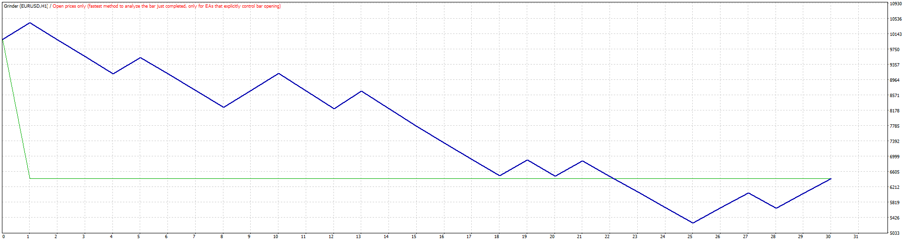
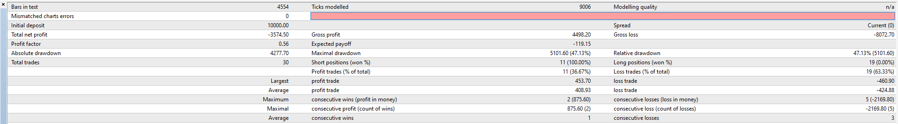
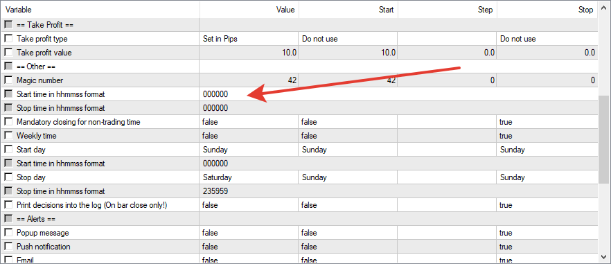

# Grinder

> Source: https://fxcodebase.com/code/viewtopic.php?f=38&t=69105  
> Forum: 38 · Topic 69105 · 6 post(s)

---

## Grinder

**Apprentice** · Thu Nov 07, 2019 9:01 am

 

Based on request.
[viewtopic.php?f=27&t=69089](https://fxcodebase.com/code/viewtopic.php?f=27&t=69089)

 [Grinder.mq4](files/129633/Grinder.mq4)

---

## Re: Grinder

**EZB-Schmarotzer** · Thu Nov 07, 2019 11:19 am

Sorry, but this version differs totally from the PRT Expert.

The PRT Expert is profitable, this one makes only losses.

Get a "Failed to create order: 148" message in the journal.

Might be the reason for the losses.

Can you please fix that issue?

---

## Re: Grinder

**EZB-Schmarotzer** · Thu Nov 07, 2019 11:27 am

Maybe the trading time is another problem.

Expert should open a position at 08:30 am GMT.

I found no parameters in the settings where I can change the trading time.

---

## Re: Grinder

**Apprentice** · Fri Nov 08, 2019 4:46 am

Your request is added to the development list.
Development reference 295.

---

## Re: Grinder

**Apprentice** · Tue Nov 12, 2019 5:39 am

Error 148 - can't repeat it. The broker limits number of orders, but orders will be deleted on every bar close, so there shouldn't be more that two of them.

---

## Re: Grinder

**EZB-Schmarotzer** · Wed Nov 13, 2019 2:10 pm

Sorry, EA makes only losses while the original code is profitable.

Never mind
