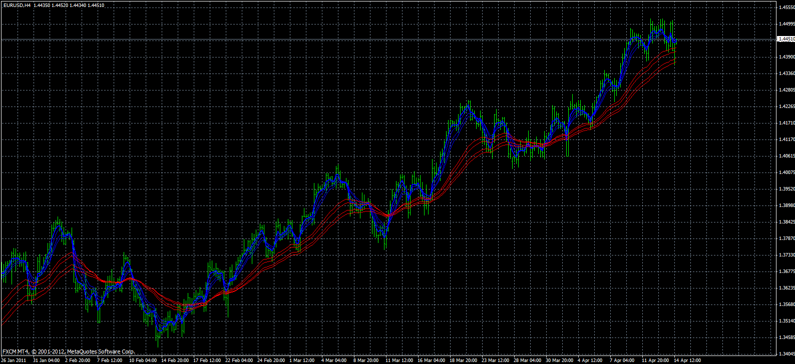
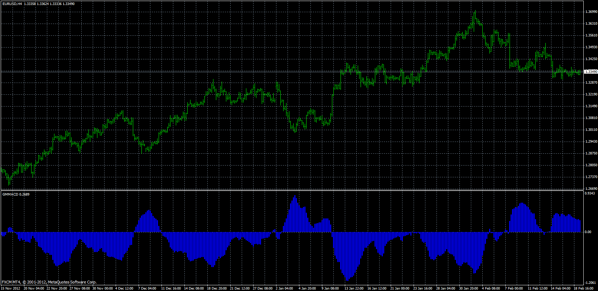

# Guppy's Multiple Moving Average

> Source: https://fxcodebase.com/code/viewtopic.php?f=38&t=37446  
> Forum: 38 · Topic 37446 · 2 post(s)

---

## Guppy's Multiple Moving Average

**Apprentice** · Sun May 12, 2013 12:23 pm

 [GMMA.mq4](files/62312/GMMA.mq4)

---

## Guppy's Multiple Moving Average Convergence/Divergence

**Apprentice** · Mon May 13, 2013 4:37 am

GMMACD (Guppy's Multiple Moving Average Convergence/Divergence) is calculated as:
f = SUM(Fast EMA's)
s = SUM(Slow EMA's)
GMMACD = (s - f) / s * 100

 [GMMACD.mq4](files/62411/GMMACD.mq4)
