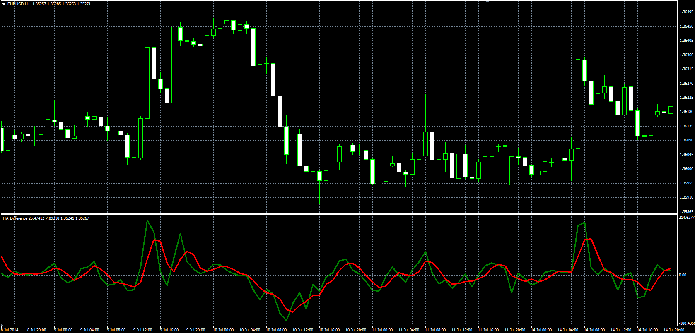

# HA Difference

> Source: https://fxcodebase.com/code/viewtopic.php?f=38&t=61052  
> Forum: 38 · Topic 61052 · 1 post(s)

---

## HA Difference

**Alexander.Gettinger** · Mon Aug 18, 2014 2:14 pm

Original LUA oscillators: [viewtopic.php?f=17&t=60133](https://fxcodebase.com/code/viewtopic.php?f=17&t=60133).

Formulas:
haOpen[i] = (haOpen[i-1]+haClose[i-1])/2,
haClose[i] = (Open[i]+High[i]+Low[i]+Close[i])/4,
haDiff[i] = haClose-haOpen,
Signal = MA(haDiff),
MA - moving average with [Method] as type and [Length] as number of periods.

 

Download:

 [haOpen.mq4](files/95426/haOpen.mq4)

 [haDiff.mq4](files/95426/haDiff.mq4)
