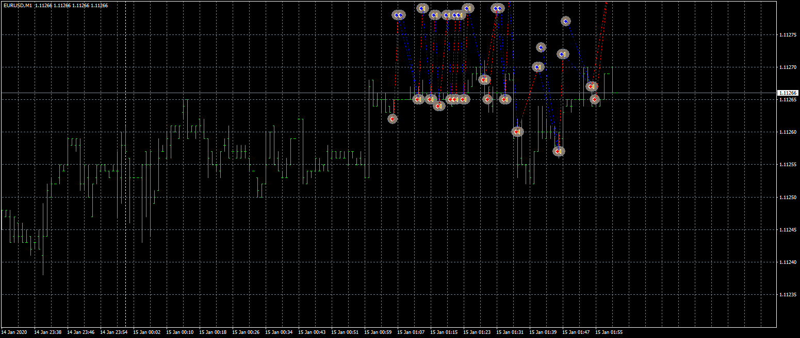

# HA EA

> Source: https://fxcodebase.com/code/viewtopic.php?f=38&t=70376  
> Forum: 38 · Topic 70376 · 5 post(s)

---

## HA EA

**Apprentice** · Fri Sep 04, 2020 2:51 am

Based on request.
[viewtopic.php?f=27&t=70284](https://fxcodebase.com/code/viewtopic.php?f=27&t=70284)

 [HA EA.mq4](files/137308/HA%20EA.mq4)

---

## Re: HA EA

**ericcky** · Mon Sep 07, 2020 12:50 am

Hi Apprentice and team,

I tried the EA out but it is not opening any trades at 1300hrs PC Time, i've set Start time to be 130000 (1pm) and Stop Time 000000 (midnight) or does it work on the MT4 server time?

I click on the Expert panel @ the Terminal, but there is no error message that stating the EA is not working, just showing the configurations that i've set for the EA on my last chart.

I look forward to your speedy reply.

Have a good day,
Eric Chai

---

## Re: HA EA

**Apprentice** · Mon Sep 07, 2020 2:01 am

Your request is added to the development list.
Development reference 1985.

---

## Re: HA EA

**Apprentice** · Thu Sep 10, 2020 2:03 am

Try this version.

---

## Re: HA EA

**ericcky** · Thu Sep 10, 2020 3:08 am

May I know what has been added in thi new version of the EA?
