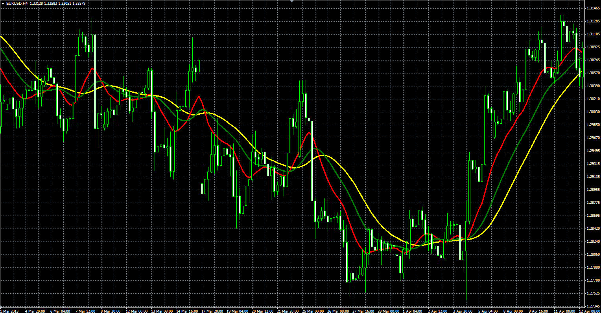

# HA EMA3 indicator

> Source: https://fxcodebase.com/code/viewtopic.php?f=38&t=41310  
> Forum: 38 · Topic 41310 · 1 post(s)

---

## HA EMA3 indicator

**Alexander.Gettinger** · Tue Jun 18, 2013 2:54 pm

The indicator is based on the moving average of the Heiken Ashi candles.

Formulas:
MA1 = MA(HA_Close),
MA2 = MA(MA1),
MA3 = MA(MA2), where
HA_Close[i] = ((Open[i]+High[i]+Low[i]+Close[i])/4+HA_Open[i]+Max(High[i], HA_Open[i])+Min(Low[i], HA_Open[i]))/4,
HA_Open[i] = ((Open[i+1]+High[i+1]+Low[i+1]+Close[i+1])/4+HA_Open[i+1])/2.

 

Download:

 [HA_EMA3.mq4](files/67538/HA_EMA3.mq4)
