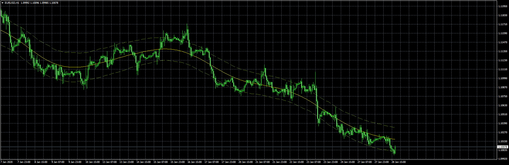

# HA_Extreme_TMA_Alert

> Source: https://fxcodebase.com/code/viewtopic.php?f=38&t=69354  
> Forum: 38 · Topic 69354 · 7 post(s)

---

## HA_Extreme_TMA_Alert

**Apprentice** · Tue Jan 28, 2020 1:49 pm

Based on TS2/Lua version.
[viewtopic.php?f=17&t=62724](https://fxcodebase.com/code/viewtopic.php?f=17&t=62724)

 [HA_Extreme_TMA_Alert.mq4](files/130945/HA_Extreme_TMA_Alert.mq4)

 [HA_Extreme_TMA_Alert Dashboard.mq4](files/130945/HA_Extreme_TMA_Alert%20Dashboard.mq4)

---

## Re: HA_Extreme_TMA_Alert

**lorenzo90l** · Wed Jan 29, 2020 2:59 am

> **Apprentice wrote:**
>
>
> The attachment **eurusd-h1-fxcm-australia-pty.png** is no longer available
>
>
> Based on TS2/Lua version.
> [viewtopic.php?f=17&t=62724](https://fxcodebase.com/code/viewtopic.php?f=17&t=62724)
>
>
> The attachment **eurusd-h1-fxcm-australia-pty.png** is no longer available

Thank you Apprendice!

I just added the slash in the comment area because it wansn't installing on my MT4.

I'm going to test in the next days! Thank you

---

## Re: HA_Extreme_TMA_Alert

**rodiasss** · Mon Feb 10, 2020 10:41 am

Good afternoon. Is it possible to make sure that the arrows do not disappear? I really liked the indicator. Or do they not disappear after the signal?

---

## Re: HA_Extreme_TMA_Alert

**Apprentice** · Tue Feb 11, 2020 6:02 am

Your request is added to the development list.
Development reference 710.

---

## Re: HA_Extreme_TMA_Alert

**Apprentice** · Wed Feb 12, 2020 1:34 pm

[HA_Extreme_TMA_Alert.mq4](files/131244/HA_Extreme_TMA_Alert.mq4)

Try this version.

---

## Re: HA_Extreme_TMA_Alert

**khai.cao** · Tue May 26, 2020 9:24 pm

Can we have MT4 version for Expert Advisor from .lua like this post? Much appreciate!

[viewtopic.php?f=31&t=62731](https://fxcodebase.com/code/viewtopic.php?f=31&t=62731)

---

## Re: HA_Extreme_TMA_Alert

**Apprentice** · Wed May 27, 2020 5:05 am

Your request is added to the development list.
Development reference 1369.
