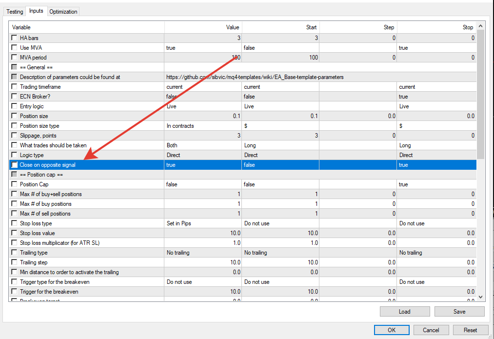

# HA Strategy

> Source: https://fxcodebase.com/code/viewtopic.php?f=38&t=70401  
> Forum: 38 · Topic 70401 · 6 post(s)

---

## HA Strategy

**Apprentice** · Tue Sep 08, 2020 4:06 am

TS2/Lua version
[viewtopic.php?f=31&t=69290](https://fxcodebase.com/code/viewtopic.php?f=31&t=69290)

 [HA Strategy.mq4](files/137426/HA%20Strategy.mq4)

---

## Re: HA Strategy

**ericcky** · Mon Sep 14, 2020 10:19 am

Hi Apprentice and Team,

Can you improve the EA by adding the logic that when an opposite signal occurs, it will close all trade for this specific pair and open a trade after the candle is closed?

Opposite signal here is if BUY:
1. The Heikin Ashi price bar turns from white (bullish) to red (bearish), close all trade for this pair.
2. Opens SELL Trade if HA candle closes as RED. Or Opens BUY Trade again if HA candle closes as White.

Vice versa for SELL situation.

Do you need more clarification?

Cheers!

---

## Re: HA Strategy

**Apprentice** · Mon Sep 14, 2020 4:43 pm

Your request is added to the development list.
Development reference 2030.

---

## Re: HA Strategy

**Apprentice** · Wed Sep 16, 2020 11:07 am

It already has such an option.

---

## Re: HA Strategy

**ericcky** · Wed Sep 16, 2020 11:17 pm

Hi Apprentice,

Yes, it has the function but it is not working. I saw many time that - for example: Buy trades are still open even after a few red HA bars has shown up after the BUY trade was placed. The EA should close the trade and open a SELL until another opp signal show up.

Kindly look into this, thank you so much for your time.

---

## Re: HA Strategy

**Apprentice** · Fri Sep 18, 2020 7:34 am

This EA doesn't trade using HA only. There are additional MA checks.
