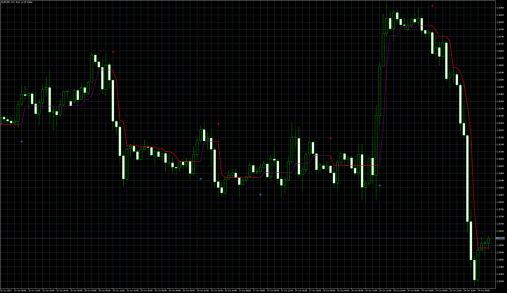

# half-trend-buy-sell-indicator

> Source: https://fxcodebase.com/code/viewtopic.php?f=38&t=71610  
> Forum: 38 · Topic 71610 · 3 post(s)

---

## half-trend-buy-sell-indicator

**Apprentice** · Sun Oct 31, 2021 3:28 am

Based on the request.
[https://fxcodebase.com/code/viewtopic.p ... 17#p144017](https://fxcodebase.com/code/viewtopic.php?f=27&p=144017#p144017)

 [half-trend-buy-sell-indicator.mq5](files/144100/half-trend-buy-sell-indicator.mq5)

---

## Re: half-trend-buy-sell-indicator

**mntiwana** · Sun Oct 31, 2021 11:52 am

> **Apprentice wrote:**
>
>
> eurusd-h1-metaquotes-software-corp.png
>
>
> Based on the request.
> [https://fxcodebase.com/code/viewtopic.p ... 17#p144017](https://fxcodebase.com/code/viewtopic.php?f=27&p=144017#p144017)
>
>
> half-trend-buy-sell-indicator.mq5

Hi Apprentice
Thanks for the code and update -
regards

---

## Re: half-trend-buy-sell-indicator

**FCodee** · Tue Nov 02, 2021 6:11 pm

Thanks for the opportunity
