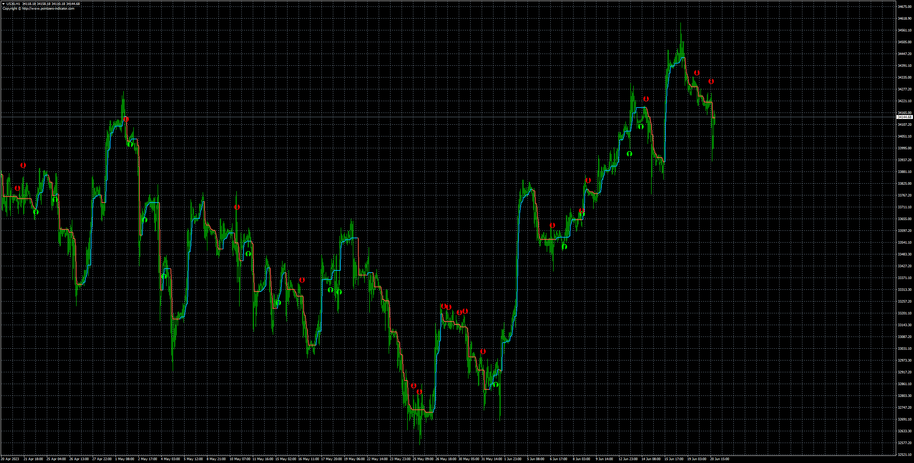
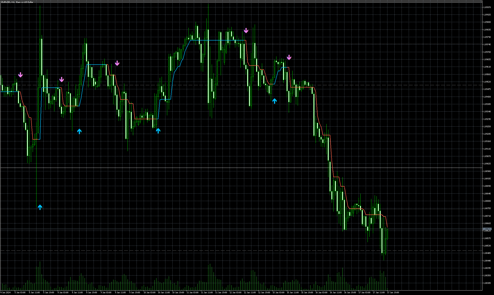

# half_trend+ntrend(nrp)

> Source: https://fxcodebase.com/code/viewtopic.php?f=38&t=73852  
> Forum: 38 · Topic 73852 · 4 post(s)

---

## half_trend+ntrend(nrp)

**Apprentice** · Tue Jun 20, 2023 1:23 pm

Based on the request.
[https://fxcodebase.com/code/viewtopic.php?f=27&p=151094](https://fxcodebase.com/code/viewtopic.php?f=27&p=151094)

 [half trend.mq4](files/151324/half%20trend.mq4)

 [NTREND.mq4](files/151324/NTREND.mq4)

 [half_trend+ntrend(nrp).mq4](files/151324/half_trendntrend%28nrp%29.mq4)

---

## Re: half_trend+ntrend(nrp)

**Codex1st** · Sun Jul 16, 2023 11:24 am

Can you give MT5?

---

## Re: half_trend+ntrend(nrp)

**Apprentice** · Thu Jul 20, 2023 2:09 pm

We have added your request to the development list.
Development reference 625.

---

## Re: half_trend+ntrend(nrp)

**Apprentice** · Sat Jul 13, 2024 12:50 am

Based on the request.
[https://fxcodebase.com/code/viewtopic.p ... 55#p151655](https://fxcodebase.com/code/viewtopic.php?f=38&p=151655#p151655)

 [half_trend.mq5](files/156096/half_trend.mq5)

 [NTREND.mq5](files/156096/NTREND.mq5)

 [half_trend+ntrend.mq5](files/156096/half_trendntrend.mq5)
