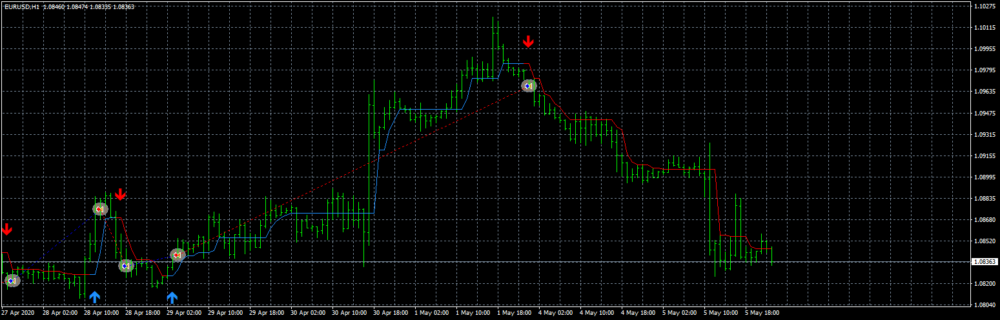
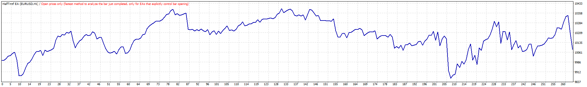
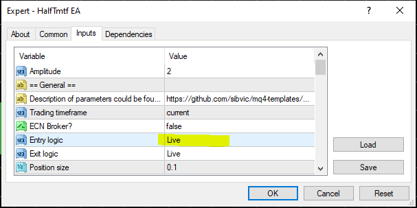
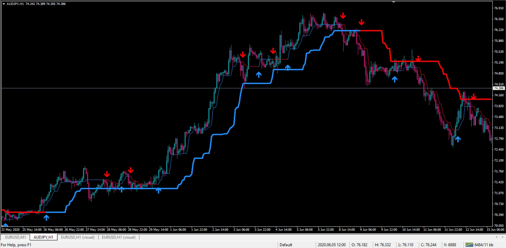
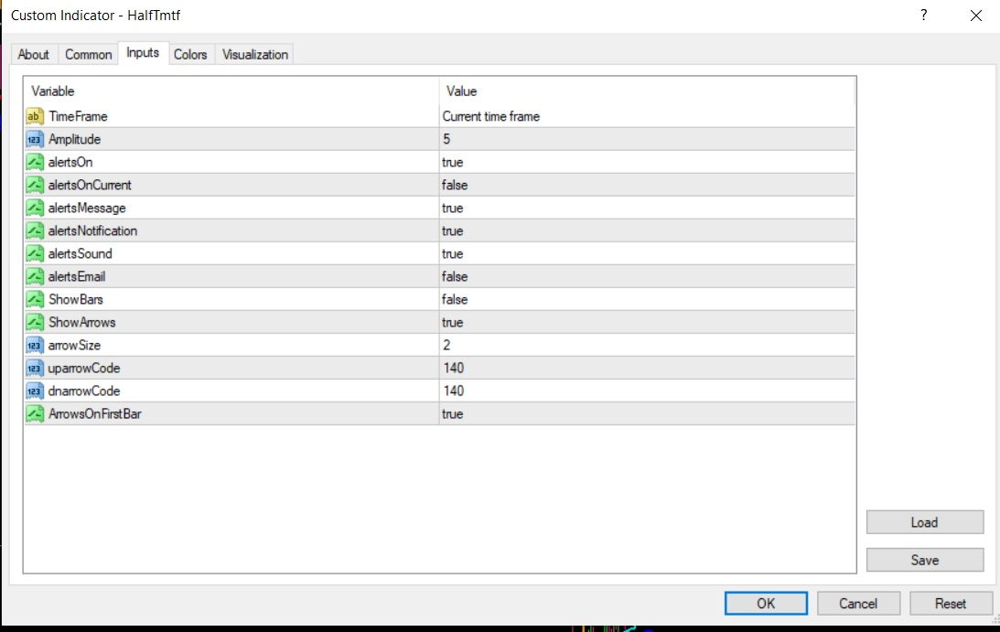
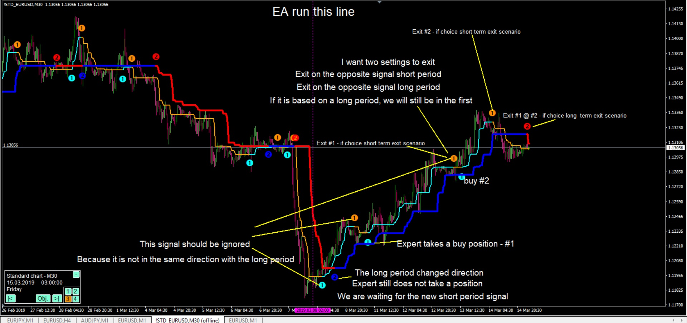

# HalfTmtf EA

> Source: https://fxcodebase.com/code/viewtopic.php?f=38&t=70104  
> Forum: 38 · Topic 70104 · 37 post(s)

---

## HalfTmtf EA

**Apprentice** · Tue Jun 30, 2020 4:27 am

 

Based on request.
[viewtopic.php?f=27&t=70097](https://fxcodebase.com/code/viewtopic.php?f=27&t=70097)

 [HalfTmtf.mq4](files/135446/HalfTmtf.mq4)

 [HalfTmtf EA.mq4](files/135446/HalfTmtf%20EA.mq4)

---

## Re: HalfTmtf EA

**zero999** · Tue Jun 30, 2020 8:00 am

> **Apprentice wrote:**
>
>
> eurusd-h1-fxcm-australia-pty.png
>
>
>
>
> TesterGraph.gif
>
>
> Based on request.
> [viewtopic.php?f=27&t=70097](https://fxcodebase.com/code/viewtopic.php?f=27&t=70097)
>
>
> HalfTmtf.mq4
>
>
>
>
> HalfTmtf EA.mq4

This indicator may signal that it is not correct before the candle closes
That is, it has a repaint before it closes
Please set the expert to consider the signal after the candle closes

---

## Re: HalfTmtf EA

**Apprentice** · Tue Jun 30, 2020 8:52 am

Please use "On Bar Close"

---

## Re: HalfTmtf EA

**zero999** · Tue Jun 30, 2020 3:10 pm

Please add a section titled Long Term Process
This part is the same indicator where we enter a process with a higher period (or higher time frame) from the main part.
In fact, if the main trend is in line with the long-term trend, the position will open

 

---

## Re: HalfTmtf EA

**Apprentice** · Wed Jul 01, 2020 3:32 am

Your request is added to the development list.
Development reference 1600.

---

## Re: HalfTmtf EA

**Apprentice** · Mon Jul 06, 2020 1:43 pm

[HalfTmtf 2.mq4](files/135672/HalfTmtf%202.mq4)

Try this version.

---

## Re: HalfTmtf EA

**zero999** · Mon Jul 06, 2020 2:18 pm

> **Apprentice wrote:**
>
>
> HalfTmtf 2.mq4
>
>
> Try this version.

what is this?
This is the same indicator

---

## Re: HalfTmtf EA

**Apprentice** · Tue Jul 07, 2020 8:01 am

A higher time frame selector was added.

---

## Re: HalfTmtf EA

**zero999** · Tue Jul 07, 2020 10:19 am

> **Apprentice wrote:**
> A higher time frame selector was added.

No, you didn't understand what I meant
I will send you an email and I will explain it to you

---

## Re: HalfTmtf EA

**zero999** · Thu Jul 09, 2020 11:26 am

> **Apprentice wrote:**
> A higher time frame selector was added.

Hello

We run the indicator twice in the chart
One with a short period (aqua and orange) and arrow number 1

 

One with a long period (blue and red) arrow number 1

 

It is possible to select a time frame for each of the long and short periods separately

Expert will be positioned with a short period indicator (arrow 1)

But it requires long-term approval ( arrow 2 )

 explained the terms of buy in the photo below
The selling situation is exactly the opposite

 

open Long if two-time frames(Or different periods) of HalfT are in agreement.
vice versa for Short

---

## Re: HalfTmtf EA

**Apprentice** · Fri Jul 10, 2020 4:38 am

Your request is added to the development list.
Development reference 1665.

---

## Re: HalfTmtf EA

**Apprentice** · Fri Jul 10, 2020 5:26 am

[HalfTmtf EA v1.1.mq4](files/135832/HalfTmtf%20EA%20v1.1.mq4)

Try this version.

---

## Re: HalfTmtf EA

**zero999** · Fri Jul 10, 2020 6:45 pm

> **Apprentice wrote:**
>
>
> HalfTmtf EA v1.1.mq4
>
>
> Try this version.

There is one part left
An section titled Amplitude for trading timeframe should be added

Long-term and short-term settings should be as follows
 ===Long-term settings ===
Amplitude (period)
Time frame (.......)

 ===Short-term settings ===
Amplitude (period)
Time frame (.......)

---

## Re: HalfTmtf EA

**zero999** · Sat Jul 18, 2020 8:25 pm

> **zero999 wrote:**
>
>
> > **Apprentice wrote:**
> >
> >
> > HalfTmtf EA v1.1.mq4
> >
> >
> > Try this version.
>
>
> There is one part left
> An section titled Amplitude for trading timeframe should be added
>
> Long-term and short-term settings should be as follows
> ===Long-term settings ===
> Amplitude (period)
> Time frame (.......)
>
> ===Short-term settings ===
> Amplitude (period)
> Time frame (.......)

ReminderReminder

---

## Re: HalfTmtf EA

**kwakugyau** · Wed Jul 29, 2020 12:04 am

Hi, I really like the indicator.
I will like to know if it repaints (indicator and EA).
Thank you.

---

## Re: HalfTmtf EA

**Apprentice** · Wed Jul 29, 2020 4:11 pm

As far as I can see, it doesn’t.

---

## Re: HalfTmtf EA

**kwakugyau** · Wed Jul 29, 2020 4:24 pm

I have watched it on M1, and it does repaint.

---

## Re: HalfTmtf EA

**taipan** · Thu Jul 30, 2020 2:01 am

> **Apprentice wrote:**
>
>
> HalfTmtf EA v1.1.mq4
>
>
> Try this version.

Hi Mario, thanks you for the HalfTmtf EA v1.1. I tried to run it on GlobalPrime demo and it has errors in the expert tab: "Failed to open positions. Trading is not allowed."

I have already enabled the expert and allow live trading, the errors still exist.

Hopefully you can take a look at it and fix the problem.

taipan

---

## Re: HalfTmtf EA

**Apprentice** · Thu Jul 30, 2020 4:50 pm

Your request is added to the development list.
Development reference 1804.

---

## Re: HalfTmtf EA

**Apprentice** · Fri Jul 31, 2020 4:34 am

It's not an EA issue. It's your MT4 issue.

---

## Re: HalfTmtf EA

**taipan** · Fri Jul 31, 2020 4:41 am

> **Apprentice wrote:**
> It's not an EA issue. It's your MT4 issue.

I have put EA to run on icmarkets.com and also put it to run on Globalprime.com. It was having the same errors and I don't think it is Mt4 issue.

I have used GP mt4 and never has a problem of running all kind of EA.

Please kindly investigate by putting it to run on GP and can see the errors.

---

## Re: HalfTmtf EA

**ARREFAMM** · Fri Jan 22, 2021 9:42 am

> **Apprentice wrote:**
>
>
> eurusd-h1-fxcm-australia-pty.png
>
>
>
>
> TesterGraph.gif
>
>
> Based on request.
> [viewtopic.php?f=27&t=70097](https://fxcodebase.com/code/viewtopic.php?f=27&t=70097)
>
>
> HalfTmtf.mq4
>
>
>
>
> HalfTmtf EA.mq4

Hi thank you for your EA but the EA dose not connecting to VPS due to "Install AdvancedNotificationsLib.dll" Can you fix this please.

best regards

---

## Re: HalfTmtf EA

**Apprentice** · Sun Jan 24, 2021 6:50 pm

Your request is added to the development list.
Development reference 115.

---

## Re: HalfTmtf EA

**Apprentice** · Sat Jan 30, 2021 8:42 am

Don't use telegram/discord or do install AdvancedNotificationsLib.dll

---

## Re: HalfTmtf EA

**ARREFAMM** · Thu Feb 25, 2021 6:15 pm

> **Apprentice wrote:**
> Don't use telegram/discord or do install AdvancedNotificationsLib.dll

 I did not use it but you should to remove this dll file from the expert to work with VPS

---

## Re: HalfTmtf EA

**Apprentice** · Sat Feb 27, 2021 3:44 am

If you not using it then the MT4 will not require it.
And it's disabled by default.

---

## Re: HalfTmtf EA

**bruno2017** · Thu Apr 22, 2021 12:13 pm

Hello, why is the robot buying while the indicator is on sale?
thank you

---

## Re: HalfTmtf EA

**Apprentice** · Fri Apr 23, 2021 3:26 am

Your request is added to the development list.
Development reference 394.

---

## Re: HalfTmtf EA

**frushtuck4u** · Sat Apr 24, 2021 7:13 am

when adding chart to a pair it gives error "Please install the HalfTmtf indicator". which i already added before adding the EA ti the chart. INDICATOR working fine but EA not adding to the charts.

solution please...

---

## Re: HalfTmtf EA

**Sufiki** · Sat Apr 24, 2021 10:50 pm

do u have non repaint version? or can you make it no repaint

---

## Re: HalfTmtf EA

**Apprentice** · Mon Apr 26, 2021 2:15 am

Unfortunately, I can't help you.
The delay would be too great.

---

## Re: HalfTmtf EA

**Apprentice** · Wed Apr 28, 2021 9:19 am

Task 394
Try this version.

 [HalfTmtf_EA.mq4](files/141783/HalfTmtf_EA.mq4)

---

## Re: HalfTmtf EA

**c900k1000** · Mon Jun 07, 2021 11:02 pm

Hello
Why only BUY has trailing?
Can SELL be designed?
and can you add on Martin for me?
thanks

---

## Re: HalfTmtf EA

**Apprentice** · Tue Jun 08, 2021 6:26 am

Your request is added to the development list.
Development reference 559.

---

## Re: HalfTmtf EA

**Apprentice** · Mon Jun 14, 2021 7:38 am

Task 559

 [HalfTmtf_EA.mq4](files/142502/HalfTmtf_EA.mq4)

Try this version.

---

## Re: HalfTmtf EA

**FCodee** · Fri Oct 29, 2021 9:45 pm

what a wonderful job

Is there a .mq5 version?

Thank you very much.

---

## Re: HalfTmtf EA

**Apprentice** · Sun Oct 31, 2021 3:46 am

Your request is added to the development list.
Development reference 959.
