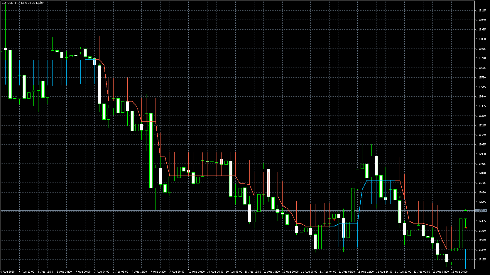

# HalfTrend 1 & alerts

> Source: https://fxcodebase.com/code/viewtopic.php?f=38&t=70288  
> Forum: 38 · Topic 70288 · 9 post(s)

---

## HalfTrend 1 & alerts

**Apprentice** · Wed Aug 12, 2020 5:15 am

Based on request.
[viewtopic.php?f=27&t=70250](https://fxcodebase.com/code/viewtopic.php?f=27&t=70250)

 [HalfTrend 1 & alerts.mq5](files/136804/HalfTrend%201%20alerts.mq5)

You need to install "HalfTrend 1 & alerts.mq5" as well

 [HalfTrend_1_&_alerts_MTF.mq5](files/136804/HalfTrend_1__alerts_MTF.mq5)

---

## Re: HalfTrend 1 & alerts

**llavll** · Tue Apr 27, 2021 7:29 am

Wow, It's like a PZ Lopez Trend! The same logic on grafhics! It's super! Thank's a lot!

---

## Re: HalfTrend 1 & alerts

**llavll** · Wed Apr 28, 2021 7:12 am

If you can add a multitimeframe parameter to it, it's will be very nice!

---

## Re: HalfTrend 1 & alerts

**Apprentice** · Wed Apr 28, 2021 1:00 pm

Your request is added to the development list.
Development reference 421.

---

## Re: HalfTrend 1 & alerts

**Apprentice** · Mon May 03, 2021 11:04 am

HalfTrend_1_&_alerts_MTF.mq5 added.

---

## Re: HalfTrend 1 & alerts

**llavll** · Tue May 11, 2021 4:25 am

Sorry, but MTF does not working properly.

---

## Re: HalfTrend 1 & alerts

**llavll** · Wed May 12, 2021 4:02 am

Thank you! But it not working properly. Please check it.

---

## Re: HalfTrend 1 & alerts

**Apprentice** · Wed May 12, 2021 5:18 am

Your request is added to the development list.
Development reference 471.

---

## Re: HalfTrend 1 & alerts

**Apprentice** · Wed May 12, 2021 9:59 am

You need to install "HalfTrend 1 & alerts.mq5" as well
