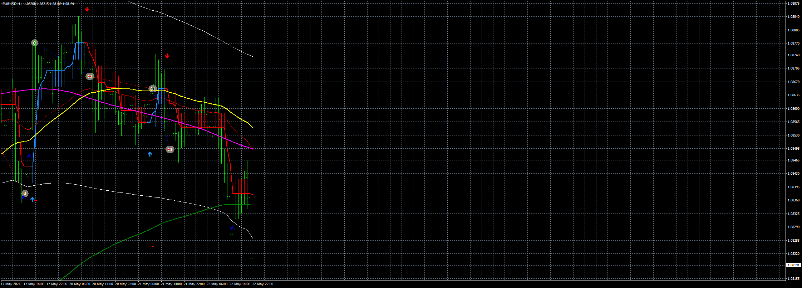

# HalfTrend+100_nrp_EA_v1.00

> Source: https://fxcodebase.com/code/viewtopic.php?f=38&t=74892  
> Forum: 38 · Topic 74892 · 4 post(s)

---

## HalfTrend+100_nrp_EA_v1.00

**Apprentice** · Wed May 22, 2024 2:11 pm

Based on the request.
[https://fxcodebase.com/code/viewtopic.php?f=27&p=155316](https://fxcodebase.com/code/viewtopic.php?f=27&p=155316)

 [HalfTrend-1.02+push_1461306941.ex4](files/155447/HalfTrend-1.02push_1461306941.ex4)

 [EA_HalfTrend_v3 (1).mq4](files/155447/EA_HalfTrend_v3%20%281%29.mq4)

 [100% Non Repaint Indicator V22.0.ex4](files/155447/100%20Non%20Repaint%20Indicator%20V22.0.ex4)

 [HalfTrend+100_nrp_EA_v1.00.mq4](files/155447/HalfTrend100_nrp_EA_v1.00.mq4)

---

## Re: HalfTrend+100_nrp_EA_v1.00

**khanatd** · Fri Jul 05, 2024 1:34 am

sir not working , false errors, plz reply , attched file

---

## Re: HalfTrend+100_nrp_EA_v1.00

**Apprentice** · Fri Jul 05, 2024 5:54 am

We have added your request to the development list.
Development reference 546

---

## Re: HalfTrend+100_nrp_EA_v1.00

**Apprentice** · Mon Jul 08, 2024 1:35 pm

I tested the EA and the indicator, and they work properly.

I have attached them without "(1)" at the end of the file names.

As the error message indicates, the attached indicator should be copied to the MQL4/Indicators folder. Then, either restart MT4 or right-click in the Navigator window and click "refresh".

 [HalfTrend-1.02+push_1461306941.ex4](files/156050/HalfTrend-1.02push_1461306941.ex4)

 [EA_HalfTrend_v3.mq4](files/156050/EA_HalfTrend_v3.mq4)
