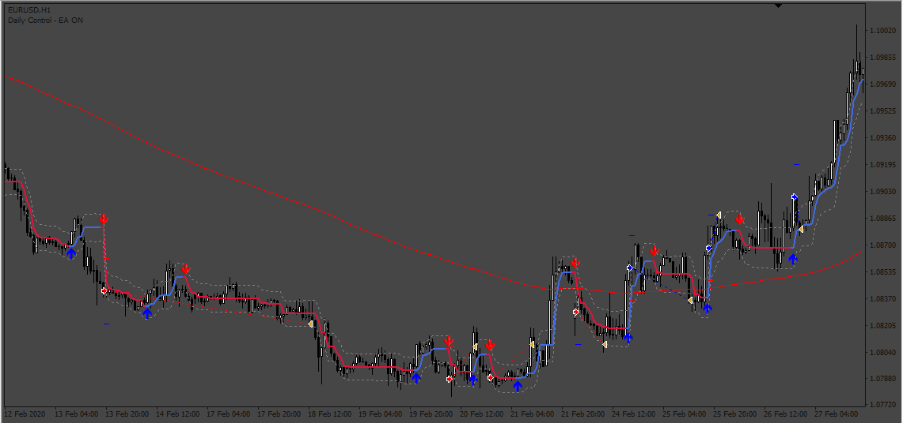

# HalfTrend_EA

> Source: https://fxcodebase.com/code/viewtopic.php?f=38&t=73477  
> Forum: 38 · Topic 73477 · 9 post(s)

---

## HalfTrend_EA

**Apprentice** · Sat Mar 11, 2023 3:39 am

Based on the request.
[https://fxcodebase.com/code/viewtopic.php?f=27&p=149858](https://fxcodebase.com/code/viewtopic.php?f=27&p=149858)

 [HalfTrend.mq4](files/149953/HalfTrend.mq4)

 [HalfTrend_EA.mq4](files/149953/HalfTrend_EA.mq4)

---

## Re: HalfTrend_EA

**amorboura** · Sun Mar 12, 2023 7:59 am

i'm getting zero result on backtest , no trade was executed !

---

## Re: HalfTrend_EA

**Apprentice** · Tue Mar 14, 2023 3:16 pm

Is HalfTrend.mq4 installed on your MT4 TS?
HalfTrend.mq4

---

## Re: HalfTrend_EA

**amorboura** · Wed Mar 15, 2023 11:09 am

Yes it is . but no result on backtest

---

## Re: HalfTrend_EA

**puneet1979** · Thu Mar 16, 2023 4:26 pm

Hi,

I am getting " array out of range in 'HalfTrend.mq4' (183,17)" on strategy tester please look into this.

Thanks

---

## Re: HalfTrend_EA

**amorboura** · Sat Mar 18, 2023 5:17 am

what i meat is that it generate few trades that's all ,only 2 previous days.
___
i wanna change that 200 MA by superIchi indicator ,but with the same rules
price must be up superIchi and up arrow must appear to enter the buy trade.
price must be down superIchi and down arrow must appear to enter sell trade.

and if it's possible : stop loss on swing (high/low) is calculated from the previous 7 candles (lower point on the last 7 candles / higher point on the last 7 candles)

___

Thanks a lot

---

## Re: HalfTrend_EA

**Apprentice** · Mon Mar 20, 2023 10:41 am

We have added your request to the development list.
Development reference 255.

---

## Re: HalfTrend_EA

**Apprentice** · Sat Mar 25, 2023 12:40 pm

I fixed the “array out of range error”
Please re-download HalfTrend

---

## Re: HalfTrend_EA

**Apprentice** · Mon May 01, 2023 3:44 am

HalfTrend_EA.mq4 was updated.
