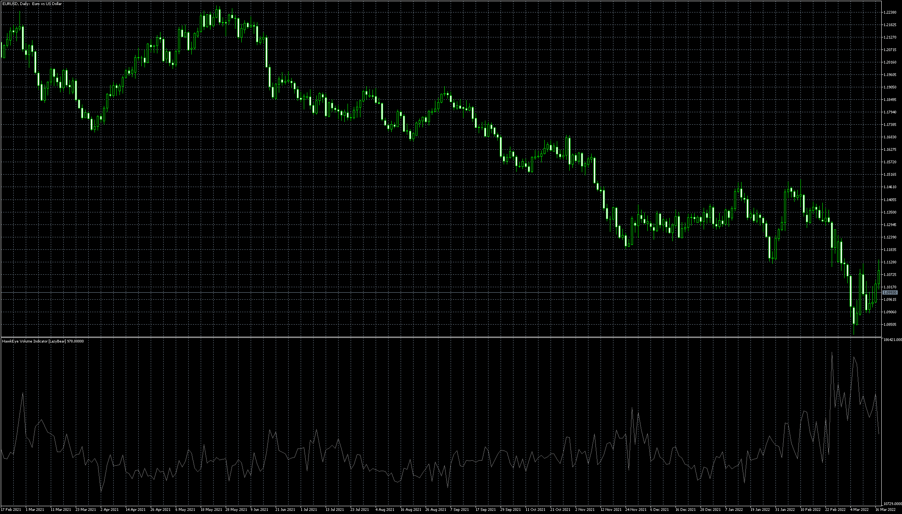

# HawkEye_Volume_Indicator

> Source: https://fxcodebase.com/code/viewtopic.php?f=38&t=72007  
> Forum: 38 · Topic 72007 · 1 post(s)

---

## HawkEye_Volume_Indicator

**Apprentice** · Mon Mar 28, 2022 5:41 pm

Based on the request.
[https://fxcodebase.com/code/viewtopic.php?f=27&p=145422](https://fxcodebase.com/code/viewtopic.php?f=27&p=145422)

 [HawkEye_Volume_Indicator_(LazyBear).mq5](files/145456/HawkEye_Volume_Indicator_LazyBear.mq5)
