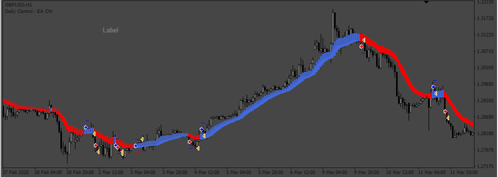

# HBH EA

> Source: https://fxcodebase.com/code/viewtopic.php?f=38&t=71800  
> Forum: 38 · Topic 71800 · 5 post(s)

---

## HBH EA

**Apprentice** · Mon Jan 17, 2022 7:16 am

Based on the request.
[https://fxcodebase.com/code/viewtopic.php?f=27&p=144657](https://fxcodebase.com/code/viewtopic.php?f=27&p=144657)

 [HBH.mq4](files/144769/HBH.mq4)

 [HBH EA.mq4](files/144769/HBH%20EA.mq4)

---

## Re: HBH EA

**Xfire2021** · Tue Jan 18, 2022 6:34 am

> **Apprentice wrote:**
>
>
> image.png
>
>
> Based on the request.
> [https://fxcodebase.com/code/viewtopic.php?f=27&p=144657](https://fxcodebase.com/code/viewtopic.php?f=27&p=144657)
>
>
> HBH.mq4
>
>
>
>
> HBH EA.mq4

Hello,
 It working for me. i was wrong about the indicator name.

thank you

---

## Re: HBH EA

**crypto0014** · Tue Jan 18, 2022 10:53 am

Please make option for auto close on opposite signal

---

## Re: HBH EA

**Apprentice** · Fri Jan 21, 2022 9:08 am

Your request is added to the development list.
Development reference 47.

---

## Re: HBH EA

**Apprentice** · Mon Jan 24, 2022 6:24 am

[HBH EA.mq4](files/144818/HBH%20EA.mq4)

Try this version.
