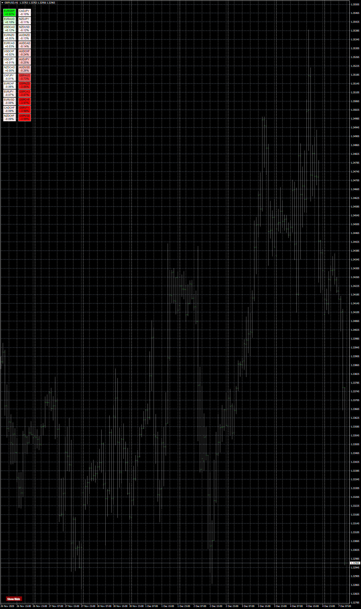

# Heat_Map_Gradient_Scale_MTF ( Unique ID )

> Source: https://fxcodebase.com/code/viewtopic.php?f=38&t=70692  
> Forum: 38 · Topic 70692 · 5 post(s)

---

## Heat_Map_Gradient_Scale_MTF ( Unique ID )

**Apprentice** · Mon Dec 07, 2020 3:16 am

 [Heat_Map_Gradient_Scale_MTF ( Unique ID ).mq4](files/139355/Heat_Map_Gradient_Scale_MTF%20%28%20Unique%20ID%20%29.mq4)

---

## Re: Heat_Map_Gradient_Scale_MTF ( Unique ID )

**Thangaraj** · Wed Dec 09, 2020 12:43 pm

> **Apprentice wrote:**
>
>
> The attachment **gbpusd-h1-fxcm-australia-pty.png** is no longer available
>
>
>
>
> The attachment **gbpusd-h1-fxcm-australia-pty.png** is no longer available

Hi sir,
For Single Instance it works Ok..!

But i Prefer Multiple Instances , When i install it Two times, There's Only One Button Working..!
And i Also Prefer **V Shaped Button.**.! i also emphasized This on my first request too..!
Below i'm attaching reference code..! and Screen shot for Your Understanding..!

I tried Adding Different Unique ID's
I Tried Making them Two Separae Files with Separate file Names
eventually Results are The Same..!

Please Make it V shaped Button..!

Thank you..!

---

## Re: Heat_Map_Gradient_Scale_MTF ( Unique ID )

**Apprentice** · Thu Dec 10, 2020 5:39 am

Your request is added to the development list.
Development reference 2434.

---

## Re: Heat_Map_Gradient_Scale_MTF ( Unique ID )

**Apprentice** · Sat Dec 12, 2020 7:44 am

Try it now.

---

## Re: Heat_Map_Gradient_Scale_MTF ( Unique ID )

**Thangaraj** · Sun Dec 13, 2020 9:08 am

> **Apprentice wrote:**
> Try it now.

Works Awesome..! Have a Great Weekend sir..!
