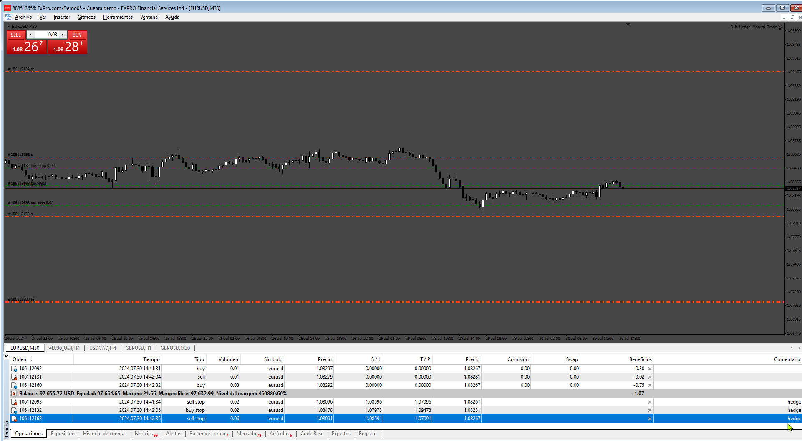
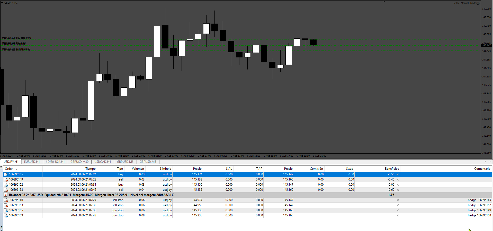
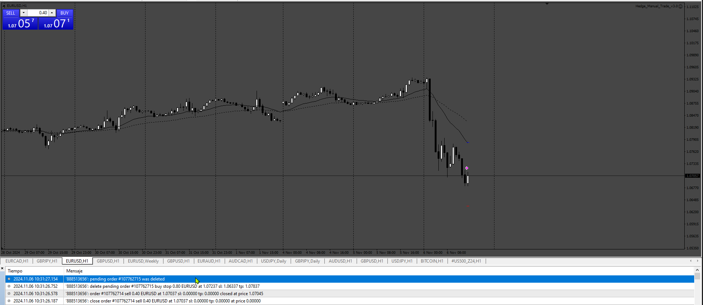

# Hedge_Manual_Trade

> Source: https://fxcodebase.com/code/viewtopic.php?f=38&t=75105  
> Forum: 38 · Topic 75105 · 12 post(s)

---

## Hedge_Manual_Trade

**Apprentice** · Tue Jul 30, 2024 3:39 pm

Based on the request.
[https://fxcodebase.com/code/viewtopic.p ... 35#p156235](https://fxcodebase.com/code/viewtopic.php?f=38&t=75091&p=156235#p156235)

 [Hedge_Manual_Trade.mq4](files/156271/Hedge_Manual_Trade.mq4)

---

## Re: Hedge_Manual_Trade

**Satya264** · Thu Aug 01, 2024 6:41 am

SIR JUST A SMALL CHANGE REMOVE ONLY ONCE AND UNLIMITED TIMES

For each position (opened by another EA or manually), the "Hedge any positions" EA opens an opposite position

---

## Re: Hedge_Manual_Trade

**Apprentice** · Mon Aug 05, 2024 4:18 am

We have added your request to the development list.
Development reference 632

---

## Re: Hedge_Manual_Trade

**Apprentice** · Mon Aug 12, 2024 3:13 pm

 [Hedge_Manual_Trade_v2.0.mq4](files/156413/Hedge_Manual_Trade_v2.0.mq4)

---

## Re: Hedge_Manual_Trade

**Satya264** · Mon Oct 07, 2024 1:42 pm

please add close by money (SHOW AS LINE FOR CLOSE TRADE) (all trade) (true or false)
 take profit (true or false) only for hedge trade
sl (true or false) only for hedge trade
break even (true or false) only for hedge trade
TSL (true or false) only for hedge trade

 "Hedge any positions" EA opens an opposite position
 please set hedge trade open immediately or instant same position every time when price goes opposite direction
if manually or EA sell trade open-2650.00 then Hedge buy trade open same position-2650.00 no distance to hedge order

make sl and tp and close by money included Commission and Swap
add a option in stoploss set same as sl automatic change to trade open positions
if hedge trade open 2650.00 then sl always set as 2650.20 (included Commission and Swap)
this stoploss only for hedge trade and stop loss enable after some pips
if once hedge trade is hit sl then again price goes opposite direction then open hedge trade on same position
every time when hedge trade is hit sl then again price goes opposite direction then open hedge trade on same position

---

## Re: Hedge_Manual_Trade

**Apprentice** · Wed Oct 09, 2024 12:32 pm

We have added your request to the development list.
Development reference 776

---

## Re: Hedge_Manual_Trade

**rajeshram** · Sun Oct 13, 2024 5:12 pm

Hi, I tested version 2.0. It works by placing pending orders in the opposite direction (based on user specified pips distance from original order settings) for manual orders taken.

Then once original order goes into negative and the pips from original order distance is triggered, the hedge order neatly gets activated.

However, once the original order is closed (say at loss by the trader before trigger is hit), EA must close the pending associated orders automatically.

Whereas in this case, EA leaves all the pending orders on screen as is as "sell stop" and "buy stop" orders and leaves it for the trader to manually delete all the pending associated orders.

Can the EA be fixed to automatically delete the pending "buy stop" and "sell stop" orders as soon as the original order is closed by the trader say manually? Is this possible otherwise, V2.0 appears to work well for auto hedging (instead of using SL)

---

## Re: Hedge_Manual_Trade

**Apprentice** · Thu Oct 17, 2024 6:28 pm

[Hedge_Manual_Trade_v3.0.mq4](files/157021/Hedge_Manual_Trade_v3.0.mq4)

Try this version.

---

## Re: Hedge_Manual_Trade

**rajeshram** · Fri Oct 18, 2024 3:37 am

Hi Apprentice, Unfortunately still same issue. Though the original order is closed, the pending sell stop and buy stop orders (associated with the original order) still remain in the pending orders log without being deleted.

Please see attached screenshot. Thank you,

---

## Re: Hedge_Manual_Trade

**rajeshram** · Fri Oct 18, 2024 3:59 am

Hi Apprentice, Just a clarification to my previous post.

That is, when the original order is closed automatically by the EA (say when it hits specified loss limit), then the associated pending order also gets automatically cancelled. So this works fine.

However, when the original order , if it is closed manually by the trader before before the original order hits tp or loss limit, then under this circumstances, the pending sell stop or buy stop order remain as is without being deleted.

The pending orders should be deleted irrespective of how original order is closed (either manually or by EA). If this can be fixed, then it will work perfectly. Thanks again.

---

## Re: Hedge_Manual_Trade

**Apprentice** · Thu Oct 31, 2024 9:01 am

We have added your request to the development list.
Development reference 827

---

## Re: Hedge_Manual_Trade

**Apprentice** · Sun Nov 10, 2024 3:29 pm

 [Hedge_Manual_Trade_v3.0.mq4](files/157234/Hedge_Manual_Trade_v3.0.mq4)
