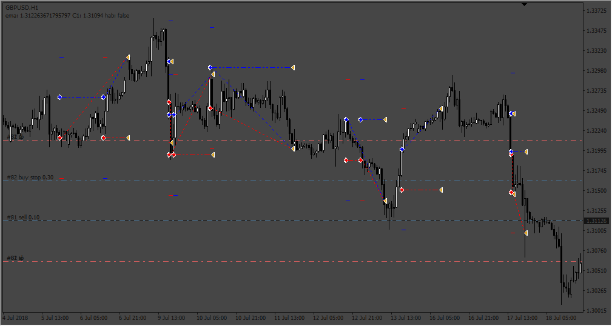
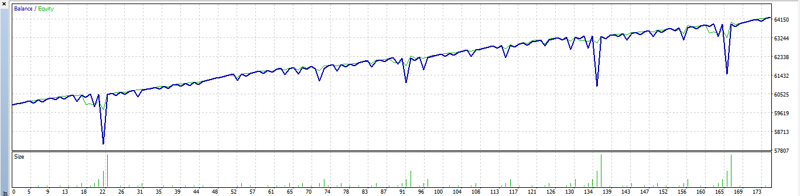

# HedgeEA

> Source: https://fxcodebase.com/code/viewtopic.php?f=38&t=72749  
> Forum: 38 · Topic 72749 · 6 post(s)

---

## HedgeEA

**Apprentice** · Fri Sep 23, 2022 10:18 am

 

Based on the request.
[https://fxcodebase.com/code/viewtopic.php?f=27&t=72699](https://fxcodebase.com/code/viewtopic.php?f=27&t=72699)

 [HedgeEA.mq4](files/147551/HedgeEA.mq4)

 [HedgeEA.mq5](files/147551/HedgeEA.mq5)

---

## Re: HedgeEA

**vishal12** · Wed Nov 02, 2022 9:51 pm

> **Apprentice wrote:**
>
>
> 552pic.png
>
>
>
>
> 552pic2.png
>
>
> Based on the request.
> [https://fxcodebase.com/code/viewtopic.php?f=27&t=72699](https://fxcodebase.com/code/viewtopic.php?f=27&t=72699)
>
>
> HedgeEA.mq4

Hi Apprentice can you please convert to MT5 also
add some Money management also
Thanks

---

## Re: HedgeEA

**Apprentice** · Fri Nov 04, 2022 3:32 am

We have added your request to the development list.
Development reference 708.

---

## Re: HedgeEA

**Apprentice** · Mon Nov 07, 2022 9:43 am

MT5 version added.

---

## Re: HedgeEA

**Gilles** · Sat Dec 03, 2022 6:23 pm

Hi Apprentice,

Please convert HedgeEA.mq4 to LUA strategy :) !
Thank you very much.

---

## Re: HedgeEA

**Apprentice** · Mon Dec 05, 2022 5:59 am

We have added your request to the development list.
Development reference 792.
