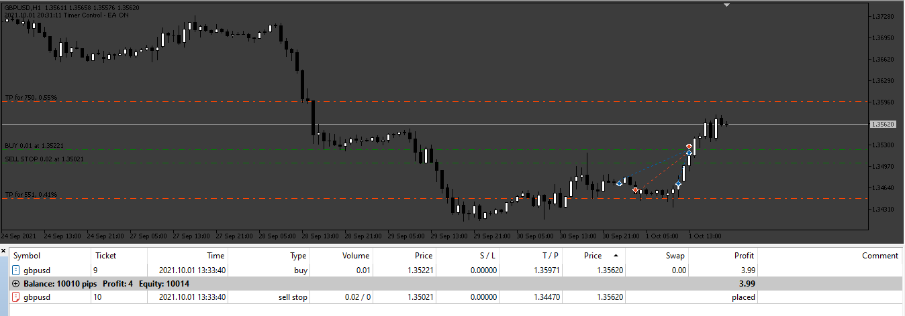
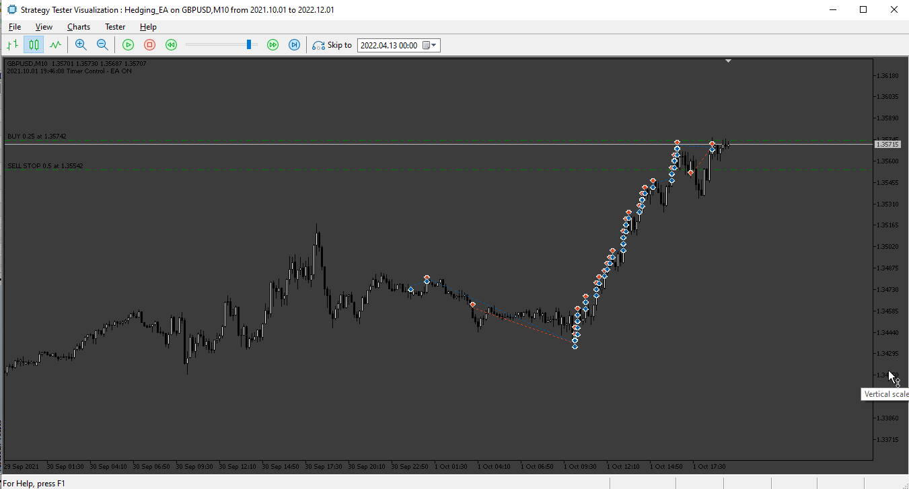

# Hedging_EA

> Source: https://fxcodebase.com/code/viewtopic.php?f=38&t=74765  
> Forum: 38 · Topic 74765 · 5 post(s)

---

## Hedging_EA

**Apprentice** · Mon Apr 08, 2024 4:28 am

Based on the request.
[https://fxcodebase.com/code/viewtopic.php?f=17&p=154793](https://fxcodebase.com/code/viewtopic.php?f=17&p=154793)

 [Hedging_EA.mq5](files/154966/Hedging_EA.mq5)

---

## Re: Hedging_EA

**rickCreations** · Sat Apr 13, 2024 1:28 am

> 2024.04.13 14:25:02.897	Core 08	pass 7170 tested with error "critical runtime error 506 in OnTester function (invalid pointer access, module Experts\HedgeEA\Hedging_EA.ex5, file Hedging_EA.mq5, line 1522, col 9)" in 0:00:08.328
> 2024.04.13 14:25:05.934	Core 16	pass 14341 tested with error "critical runtime error 506 in OnTester function (invalid pointer access, module Experts\HedgeEA\Hedging_EA.ex5, file Hedging_EA.mq5, line 1522, col 9)" in 0:00:04.671
> 2024.04.13 14:25:06.111	Core 14	pass 8197 tested with error "critical runtime error 506 in OnTester function (invalid pointer access, module Experts\HedgeEA\Hedging_EA.ex5, file Hedging_EA.mq5, line 1522, col 9)" in 0:00:04.413
> 2024.04.13 14:25:10.583	Core 16	pass 14342 tested with error "critical runtime error 506 in OnTester function (invalid pointer access, module Experts\HedgeEA\Hedging_EA.ex5, file Hedging_EA.mq5, line 1522, col 9)" in 0:00:04.645
> 2024.04.13 14:25:11.219	Core 08	pass 7171 tested with error "critical runtime error 506 in OnTester function (invalid pointer access, module Experts\HedgeEA\Hedging_EA.ex5, file Hedging_EA.mq5, line 1522, col 9)" in 0:00:08.285
> 2024.04.13 14:25:11.234	Core 14	pass 8198 tested with error "critical runtime error 506 in OnTester function (invalid pointer access, module Experts\HedgeEA\Hedging_EA.ex5, file Hedging_EA.mq5, line 1522, col 9)" in 0:00:05.115
> 2024.04.13 14:25:15.008	Core 16	pass 14343 tested with error "critical runtime error 506 in OnTester function (invalid pointer access, module Experts\HedgeEA\Hedging_EA.ex5, file Hedging_EA.mq5, line 1522, col 9)" in 0:00:04.420
> 2024.04.13 14:25:16.373	Core 14	pass 8199 tested with error "critical runtime error 506 in OnTester function (invalid pointer access, module Experts\HedgeEA\Hedging_EA.ex5, file Hedging_EA.mq5, line 1522, col 9)" in 0:00:05.140
> 2024.04.13 14:25:17.848	Core 03	pass 1026 tested with error "critical runtime error 506 in OnTester function (invalid pointer access, module Experts\HedgeEA\Hedging_EA.ex5, file Hedging_EA.mq5, line 1522, col 9)" in 0:00:15.873
> 2024.04.13 14:25:19.442	Core 16	pass 14344 tested with error "critical runtime error 506 in OnTester function (invalid pointer access, module Experts\HedgeEA\Hedging_EA.ex5, file Hedging_EA.mq5, line 1522, col 9)" in 0:00:04.431

Because of this line:

Code: [Select all](https://fxcodebase.com/code/)
`bool doAction()
  {
    if (newOrder.type() == ORDER_TYPE_BUY_STOP) {
      if (!trade.BuyStop(newOrder.lot(), newOrder.price(), newOrder.symbol(), newOrder.sl(), newOrder.tp(), 0, 0, newOrder.comment())) {
        Print(__FUNCTION__, " ", "Cannot Send Order, error: ", GetLastError());
        return false;
      }
    }
    if (newOrder.type() == ORDER_TYPE_SELL_STOP) {
      if (!trade.SellStop(newOrder.lot(), newOrder.price(), newOrder.symbol(), newOrder.sl(), newOrder.tp(), 0, 0, newOrder.comment())) {
        Print(__FUNCTION__, " ", "Cannot Send Order, error: ", GetLastError());
        return false;
      }
    }

    if (!trade.PositionOpen(newOrder.symbol(), newOrder.type(), newOrder.lot(), newOrder.price(), newOrder.sl(), newOrder.tp(), newOrder.comment())) {
      Print(__FUNCTION__, " ", "Cannot Send Order, error: ", GetLastError());
      return false;
    }
    return true;
  }`

many of your EA are now not working because your using C++ in your coding instead of using mq5 or mq4 coding.

---

## Re: Hedging_EA

**rickCreations** · Sat Apr 13, 2024 1:41 am

> 2024.04.13 14:40:51.002	Core 01	2023.02.03 16:40:39 failed market buy 0 GBPUSD [Invalid volume]
> 2024.04.13 14:40:51.002	Core 01	2023.02.03 16:40:39 CTrade::OrderSend: market buy 0.00 GBPUSD [invalid volume]
> 2024.04.13 14:40:51.002	Core 01	2023.02.03 16:40:39 SendNewOrder::doAction Cannot Send Order, error: 4756
> 2024.04.13 14:40:51.002	Core 01	2023.02.03 16:40:39 LotCalculator::CalculateLots Set Distance
> 2024.04.13 14:40:51.002	Core 01	2023.02.03 16:40:39 failed market buy 0 GBPUSD [Invalid volume]
> 2024.04.13 14:40:51.002	Core 01	2023.02.03 16:40:39 CTrade::OrderSend: market buy 0.00 GBPUSD [invalid volume]
> 2024.04.13 14:40:51.002	Core 01	2023.02.03 16:40:39 SendNewOrder::doAction Cannot Send Order, error: 4756

THESE FUNCTIONS ARE BROKEN:

Code: [Select all](https://fxcodebase.com/code/)
`input double       userMoney      = 10;                 // Setup Lots by "Money":
input double       userBalancePer = 0.1;                // Setup Lots by "Account Percent":`

---

## Re: Hedging_EA

**rickCreations** · Sat Apr 13, 2024 1:44 am

Code: [Select all](https://fxcodebase.com/code/)
`2024.04.13 14:43:27.196   Core 01   2023.04.03 10:38:02   sell stop 0.01 GBPUSD at 1.23015 (1.23215 / 1.23215)
2024.04.13 14:43:27.196   Core 01   2023.04.03 10:38:02   CTrade::OrderSend: sell stop 0.01 GBPUSD at 1.23015 [done]
2024.04.13 14:43:27.196   Core 01   2023.04.03 10:38:02   SendNewOrder::doAction Cannot Send Order, error: 4756`

Reason:

> error 4756. This error will occur when sending a negotiation request failed because of any of the following reasons: Invalid lot size Invalid stop loss

---

## Re: Hedging_EA

**Apprentice** · Mon Apr 22, 2024 9:34 am

I tested the features and they work well.

 [Hedging_EA.mq5](files/155071/Hedging_EA.mq5)
