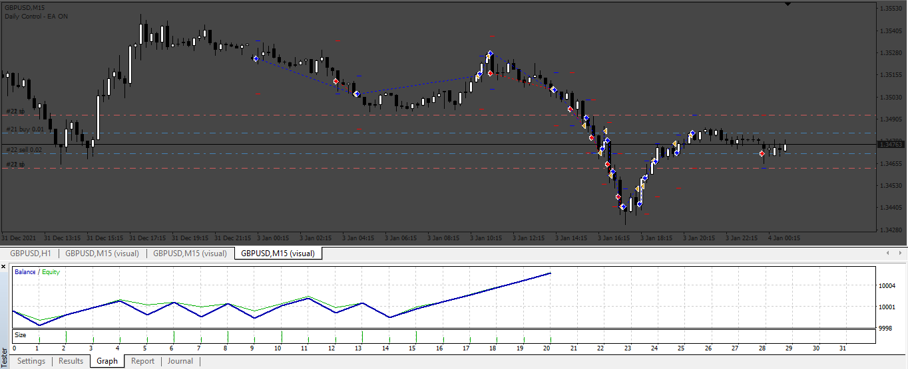
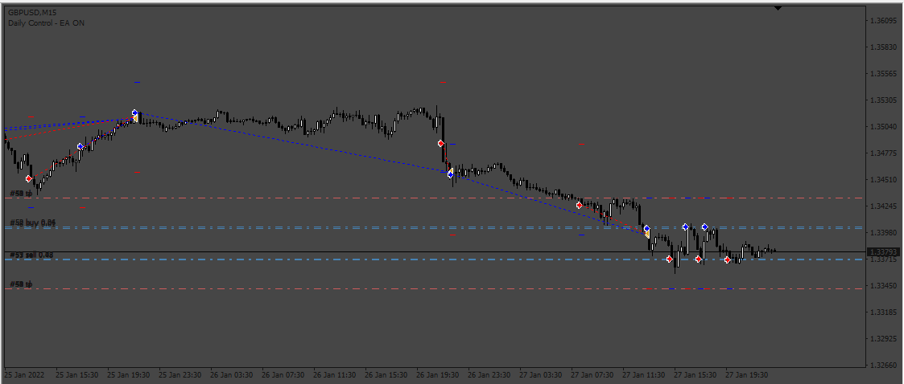
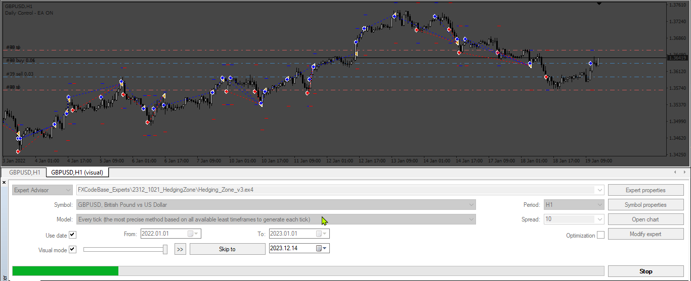

# Hedging_Zone

> Source: https://fxcodebase.com/code/viewtopic.php?f=38&t=74310  
> Forum: 38 · Topic 74310 · 8 post(s)

---

## Hedging_Zone

**Apprentice** · Wed Nov 01, 2023 4:06 pm

Based on the request.
[https://fxcodebase.com/code/viewtopic.php?f=38&t=74232](https://fxcodebase.com/code/viewtopic.php?f=38&t=74232)

 [Hedging_Zone.mq4](files/153146/Hedging_Zone.mq4)

---

## Re: Hedging_Zone

**Appu264** · Thu Nov 02, 2023 1:57 am

SIR PLEASE CHANGE RECOVERY ZONE SIZE IN PIPS
WHEN TP IS HIT CLOSE ALL TRADES BUY AND SELL BOTH

---

## Re: Hedging_Zone

**topntown** · Thu Nov 02, 2023 3:46 pm

Sir can u fix error recovery zone in pips
Without using grid
Please use sell stop and buy stop like those photo
Without any error
1st trade entry is automated like buy 0.01
Full EA DETAILS IN THOSE PIC-1-2-3

---

## Re: Hedging_Zone

**Apprentice** · Sat Nov 04, 2023 10:38 am

We have added your request to the development list.
Development reference 981

---

## Re: Hedging_Zone

**Apprentice** · Fri Nov 10, 2023 2:34 pm

 [Hedging_Zone_v2.mq4](files/153231/Hedging_Zone_v2.mq4)

---

## Re: Hedging_Zone

**Appu264** · Mon Nov 13, 2023 2:53 am

PLEASE
SIR CORRECTION ZONE ISSUE IN FIX PIPS I HAVE PROBLEM IN BACK TESTING
PLEASE USE SELL STOP AND BUY STOP

---

## Re: Hedging_Zone

**Apprentice** · Fri Nov 17, 2023 5:44 am

We have added your request to the development list.
Development reference 1021

---

## Re: Hedging_Zone

**Apprentice** · Wed Dec 20, 2023 2:53 am

please use “all ticks” mode in back tester

 [Hedging_Zone_v3.mq4](files/153738/Hedging_Zone_v3.mq4)
