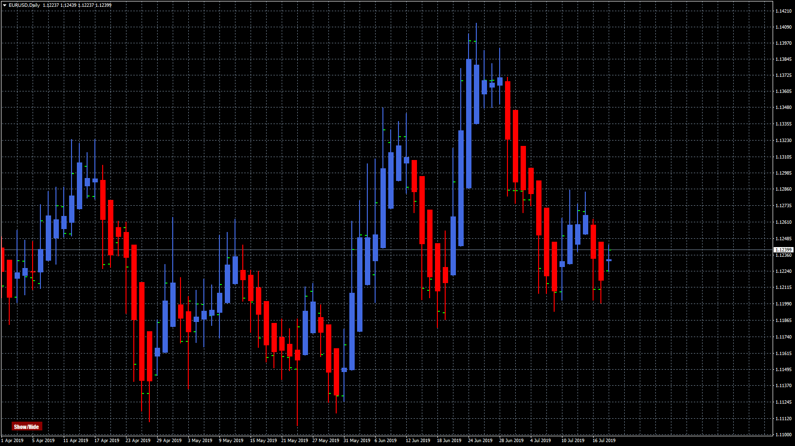

# Heiken_Ashi_AutoWidth

> Source: https://fxcodebase.com/code/viewtopic.php?f=38&t=68676  
> Forum: 38 · Topic 68676 · 5 post(s)

---

## Heiken_Ashi_AutoWidth

**Apprentice** · Thu Jul 18, 2019 4:33 am

Based on request.
[viewtopic.php?f=27&t=68664](https://fxcodebase.com/code/viewtopic.php?f=27&t=68664)

 [Heiken_Ashi_AutoWidth.mq4](files/127399/Heiken_Ashi_AutoWidth.mq4)

---

## Re: Heiken_Ashi_AutoWidth

**ldp770822** · Thu Jul 18, 2019 4:54 am

I got it now, thank you very much for the work of the moderator!

---

## Re: Heiken_Ashi_AutoWidth

**yolerap** · Wed Jan 01, 2020 2:53 pm

Hi Apprentice,

Could you please create a new strategy based on the Heiken Hashi please ?

Long rules :
Buy when 3 green candles in a row and the price is > 100 MVA

Short rules :
Sell when 3 red candles in a row and the price is < 100 MVA

Please, add the options :
* Use MVA or not
* How many candles look back for Heiken Ashi
* Number of positions
* Timeframe trading
* Start and end time trading
* Stop limit and trailing stop
* Take profit and trailing limit
* Breakeven with trailing
* Entry execution

Thank you,

Yolerap.

---

## Re: Heiken_Ashi_AutoWidth

**Apprentice** · Fri Jan 03, 2020 3:57 am

Your request is added to the development list.
Development reference 513.

---

## Re: Heiken_Ashi_AutoWidth

**Apprentice** · Fri Jan 03, 2020 8:06 am

Try this version.
[viewtopic.php?f=31&t=69290](https://fxcodebase.com/code/viewtopic.php?f=31&t=69290)
