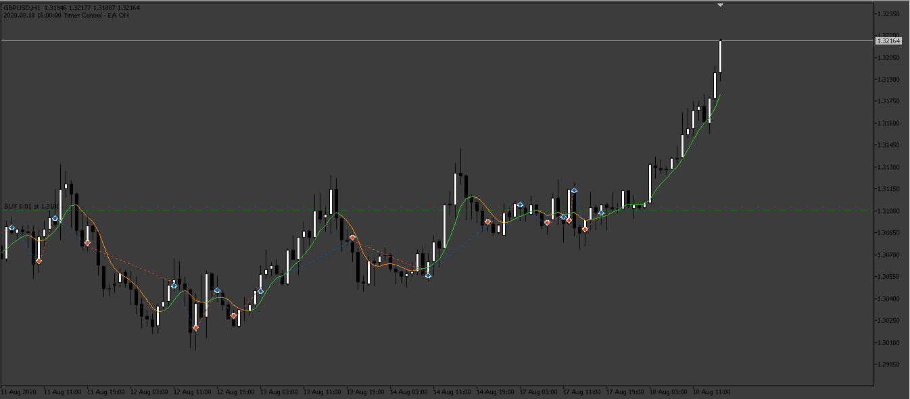
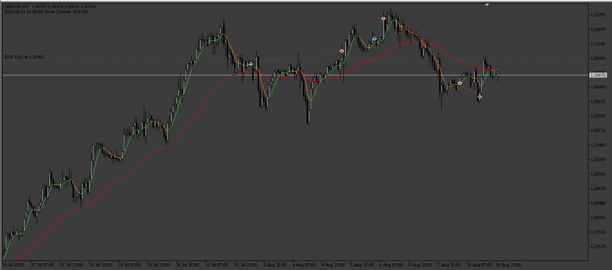

# Heiken_Ashi_Smoothed_EA

> Source: https://fxcodebase.com/code/viewtopic.php?f=38&t=73609  
> Forum: 38 · Topic 73609 · 5 post(s)

---

## Heiken_Ashi_Smoothed_EA

**Apprentice** · Sat Apr 15, 2023 4:53 am

Based on the request.
[https://fxcodebase.com/code/viewtopic.php?f=27&p=150335](https://fxcodebase.com/code/viewtopic.php?f=27&p=150335)

 [heiken-ashi-smoothedLine.mq5](files/150439/heiken-ashi-smoothedLine.mq5)

 [Heiken_Ashi_Smoothed_EA.mq5](files/150439/Heiken_Ashi_Smoothed_EA.mq5)

---

## Re: Heiken_Ashi_Smoothed_EA

**ACast2022** · Sun May 14, 2023 7:22 am

Admin. Could you please add a moving average to this EA.

Moving average (true/false)

If true, you put the data of the moving average, in the settings, and then, above moving average selected, only take buy positions, below only take sell positions.

Thanks!

---

## Re: Heiken_Ashi_Smoothed_EA

**Apprentice** · Fri May 19, 2023 7:07 am

We have added your request to the development list.
Development reference 455.

---

## Re: Heiken_Ashi_Smoothed_EA

**Apprentice** · Sat May 20, 2023 1:52 am

 [Heiken_Ashi_Smoothed_EA_with_MA.mq5](files/150926/Heiken_Ashi_Smoothed_EA_with_MA.mq5)

---

## Re: Heiken_Ashi_Smoothed_EA

**ACast2022** · Tue May 23, 2023 6:45 am

> **Apprentice wrote:**
>
>
> 455pic.png
>
>
>
>
> Heiken_Ashi_Smoothed_EA_with_MA.mq5

Thank you very much!
