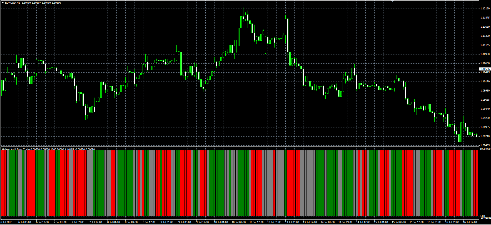

# Heiken Ashi Zone Trade

> Source: https://fxcodebase.com/code/viewtopic.php?f=38&t=62486  
> Forum: 38 · Topic 62486 · 1 post(s)

---

## Heiken Ashi Zone Trade

**Alexander.Gettinger** · Wed Jul 29, 2015 7:38 am

Original LUA indicator: [viewtopic.php?f=17&t=62332](http://www.fxcodebase.com/code/viewtopic.php?f=17&t=62332).

> Will paint candles based on AO + AC indicator indications.
> You can choose HA or Price as AO / AC indicator source.

 

Download:

 [Heiken_Ashi_Zone_Trade.mq4](files/101594/Heiken_Ashi_Zone_Trade.mq4)
