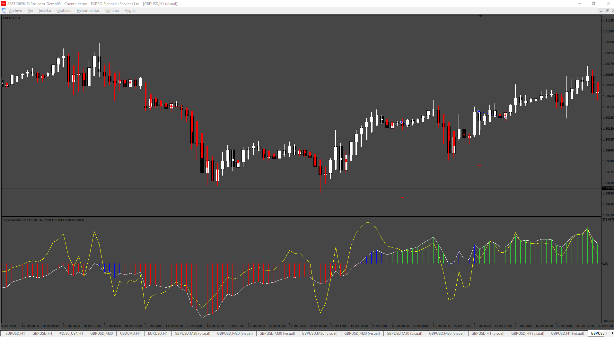

# Heiken_Woodie_EA

> Source: https://fxcodebase.com/code/viewtopic.php?f=38&t=75144  
> Forum: 38 · Topic 75144 · 2 post(s)

---

## Heiken_Woodie_EA

**Apprentice** · Fri Aug 16, 2024 5:07 pm

Based on the request.
[https://fxcodebase.com/code/viewtopic.p ... 19#p156419](https://fxcodebase.com/code/viewtopic.php?f=27&p=156419#p156419)

 [SuperWoodieCCI.mq4](files/156446/SuperWoodieCCI.mq4)

 [Heiken_Woodie_EA.mq4](files/156446/Heiken_Woodie_EA.mq4)

---

## Re: Heiken_Woodie_EA

**tc1688** · Mon Aug 19, 2024 3:29 am

> **Apprentice wrote:**
>
>
> 651.png
>
>
> Based on the request.
> [https://fxcodebase.com/code/viewtopic.p ... 19#p156419](https://fxcodebase.com/code/viewtopic.php?f=27&p=156419#p156419)
>
>
> SuperWoodieCCI.mq4
>
>
>
>
> Heiken_Woodie_EA.mq4

thank you for your assistance
But it’s a little different from reality
I'm thinking about how to make it clear
