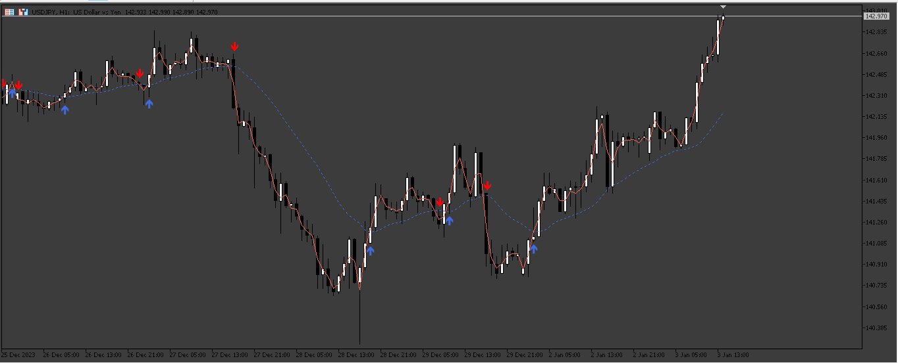
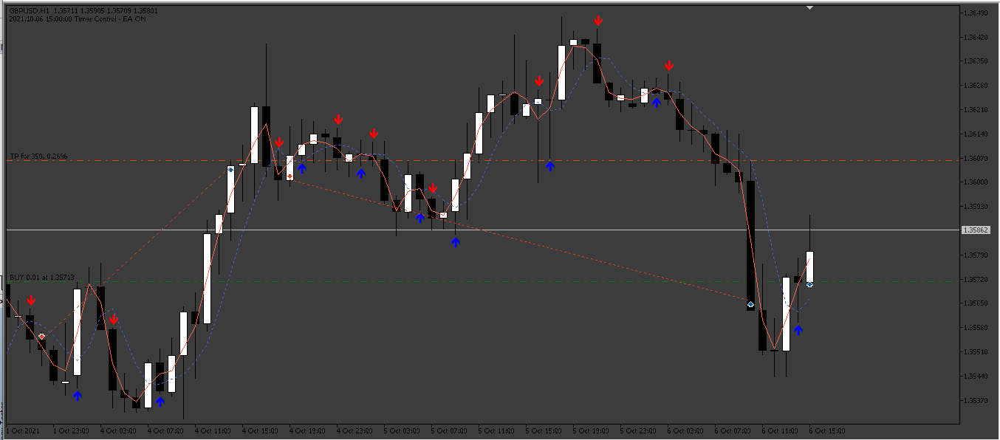
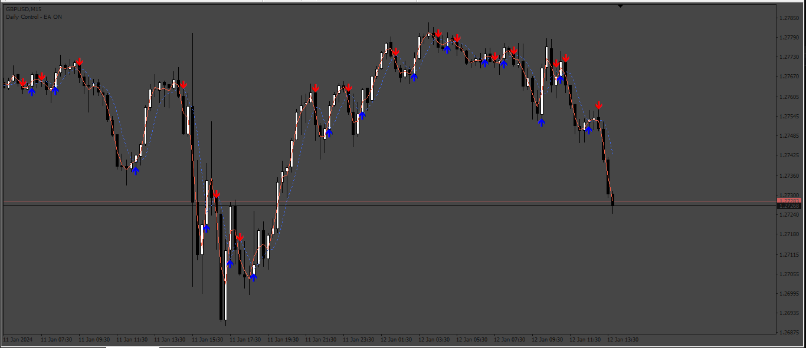

# HeikenAshi_Lines

> Source: https://fxcodebase.com/code/viewtopic.php?f=38&t=74515  
> Forum: 38 · Topic 74515 · 4 post(s)

---

## HeikenAshi_Lines

**Apprentice** · Sat Jan 06, 2024 2:49 am

 

Based on the request.
[https://fxcodebase.com/code/viewtopic.php?f=17&t=74482](https://fxcodebase.com/code/viewtopic.php?f=17&t=74482)

 [HeikenAshi_Lines.mq5](files/153939/HeikenAshi_Lines.mq5)

 [HeikenAshi_Lines_EA.mq5](files/153939/HeikenAshi_Lines_EA.mq5)

 

 

 [Heiken_Ashi_Lines.mq4](files/153939/Heiken_Ashi_Lines.mq4)

 [Heiken_Ashi_Lines_EA.mq4](files/153939/Heiken_Ashi_Lines_EA.mq4)

---

## Re: HeikenAshi_Lines

**Appu264** · Mon Jan 08, 2024 11:27 pm

make as mt4 version

BUY ARROW BUY TRADE
SELL ARROW SELL TRADE
CLOSE ALL TRADE OPPOSITE SIGNAL
CLOSE BY MONEY
ADD NEWS FILTER CLOSE ALL TRADE BEFORE 15MINS RED NEWS ENABLE EA AFTER 30MINS

---

## Re: HeikenAshi_Lines

**Apprentice** · Wed Jan 10, 2024 7:13 am

We have added your request to the development list.
Development reference 40

---

## Re: HeikenAshi_Lines

**Apprentice** · Sat Jan 13, 2024 2:58 pm

MT4 version added.
