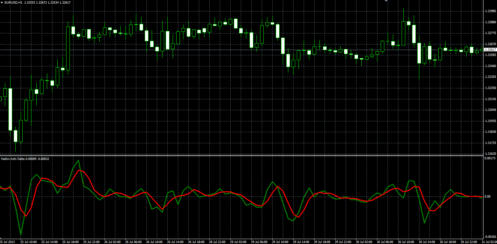

# Heikin-Ashi Delta

> Source: https://fxcodebase.com/code/viewtopic.php?f=38&t=59132  
> Forum: 38 · Topic 59132 · 7 post(s)

---

## Heikin-Ashi Delta

**Alexander.Gettinger** · Wed Aug 14, 2013 3:14 pm

Original LUA oscillator: [http://fxcodebase.com/code/viewtopic.php?f=17&t=22967](https://fxcodebase.com/code/viewtopic.php?f=17&t=22967).

 

Download:

 [HA_Delta.mq4](files/88590/HA_Delta.mq4)

---

## Re: Heikin-Ashi Delta

**kusali** · Thu Feb 04, 2016 12:02 pm

Hiya
Thanks for this.

Was wondering is it possible please to have this updated/modified for MT4 per the Dan Valcu modification here [http://fxcodebase.com/code/viewtopic.php?f=17&t=22967](https://fxcodebase.com/code/viewtopic.php?f=17&t=22967)

This would be greatly appreciated.

Thanking you in advance.

Cheers

---

## Re: Heikin-Ashi Delta

**kusali** · Thu Mar 31, 2016 1:11 pm

Hi there,
Just bumping this to see if this is possible per above post.

Many Thanks
J

---

## Re: Heikin-Ashi Delta

**Apprentice** · Wed Apr 06, 2016 11:03 am

Dan Valcu HA Delta.lua or Dan Valcu HA Delta Modification.lua?

---

## Re: Heikin-Ashi Delta

**bartwas1** · Thu May 24, 2018 9:02 am

Hello Apprentice

Since I've learnt about Dan Valcu HA Delta Modification for lua and I wondered if a mt4 version of this oscillator could be done and if possible with time frame change option (in order to change current time frame into higher one). It's simply a great trading tool. Thanks in advance, no rush.

kind regs
Bart

---

## Re: Heikin-Ashi Delta

**Apprentice** · Mon May 28, 2018 10:59 am

Your request is added to the development list under Id Number 4152

---

## Re: Heikin-Ashi Delta

**Apprentice** · Mon Jun 18, 2018 6:50 am

[Dan Valcu HA Delta Modification.mq4](files/119609/Dan%20Valcu%20HA%20Delta%20Modification.mq4)

Try this version.
