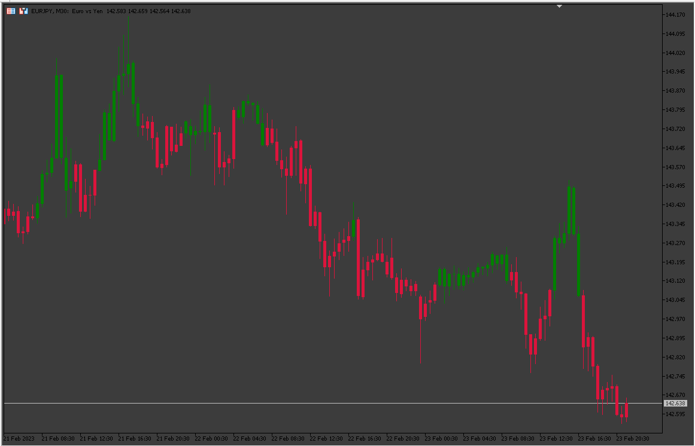
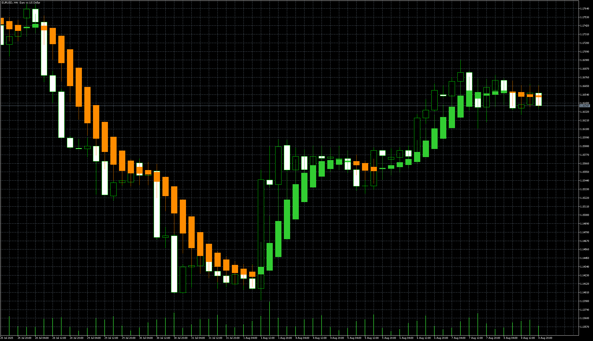

# Heinken_Ashi_Color_Candles

> Source: https://fxcodebase.com/code/viewtopic.php?f=38&t=73432  
> Forum: 38 · Topic 73432 · 8 post(s)

---

## Heinken_Ashi_Color_Candles

**Apprentice** · Tue Feb 28, 2023 6:17 am

Based on the request.
[https://fxcodebase.com/code/viewtopic.php?f=27&p=149679](https://fxcodebase.com/code/viewtopic.php?f=27&p=149679)

 [heiken-ashi-smoothed.mq5](files/149817/heiken-ashi-smoothed.mq5)

 [Heinken_Ashi_Color_Candles.mq5](files/149817/Heinken_Ashi_Color_Candles.mq5)

---

## Re: Heinken_Ashi_Color_Candles

**Sensible** · Mon Mar 06, 2023 8:38 am

Heinken_Ashi_Color_Candles.mq5,

Please can you make Mq4 EA of this above indicator
i.e Heinken_Ashi_Colour_Candles.mq4

---

## Re: Heinken_Ashi_Color_Candles

**logicgate** · Mon Mar 06, 2023 7:22 pm

Thanks buddy

Is it possible to merge both indicators into one instead of having to call another indicator?

---

## Re: Heinken_Ashi_Color_Candles

**Apprentice** · Sat Mar 11, 2023 4:42 am

We have added your request to the development list.
Development reference 238.

---

## Re: Heinken_Ashi_Color_Candles

**logicgate** · Sun Jul 30, 2023 4:48 am

Hello dear friend Apprentice, since march no updates, have you forgotten about this request?
It's just merging both codes into one.

Best regards

---

## Re: Heinken_Ashi_Color_Candles

**hadesgodza** · Wed Oct 25, 2023 5:28 pm

Can you write Seisson colors candle

---

## Re: Heinken_Ashi_Color_Candles

**Apprentice** · Thu Oct 26, 2023 2:08 am

Seisson?

Session or season?
As one candle or one Session / season.

---

## Re: Heinken_Ashi_Color_Candles

**Apprentice** · Sun Aug 10, 2025 4:15 am

 [Heinken_Ashi_Color_Candles_v2.mq5](files/160176/Heinken_Ashi_Color_Candles_v2.mq5)
