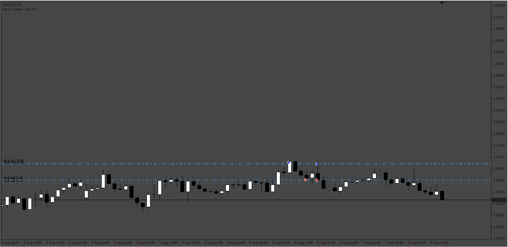
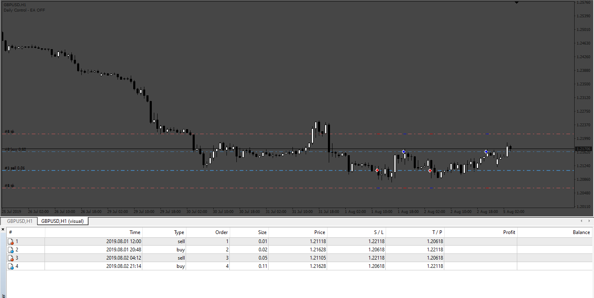

# HeinkenAshi_ZoneRecovery

> Source: https://fxcodebase.com/code/viewtopic.php?f=38&t=72916  
> Forum: 38 · Topic 72916 · 4 post(s)

---

## HeinkenAshi_ZoneRecovery

**Apprentice** · Tue Nov 08, 2022 7:03 am

Based on the request.
[https://fxcodebase.com/code/viewtopic.php?f=27&p=148123](https://fxcodebase.com/code/viewtopic.php?f=27&p=148123)

 [HeinkenAshi_ZoneRecovery.mq4](files/148221/HeinkenAshi_ZoneRecovery.mq4)

---

## Re: HeinkenAshi_ZoneRecovery

**AMC1979** · Wed Nov 09, 2022 11:04 am

Hi,

Thanks for creating this EA!

I've noticed that the EA doesn't place a take profit after the first order.

I set a take profit of 50 pips, for the first order it's fine, but when the 2nd trade takes place (when grid/recovery zone begins), it doesn't set a take profit.

I've attached an image, the first trade was a buy with take profit above, the 2nd trade was a sell but the EA didn't place a take profit. It should've placed a take profit of 50 pips at the bottom too.

Can you have a look.

Thanks again!

---

## Re: HeinkenAshi_ZoneRecovery

**Apprentice** · Sun Nov 13, 2022 4:01 am

We have added your request to the development list.
Development reference 735.

---

## Re: HeinkenAshi_ZoneRecovery

**Apprentice** · Wed Nov 30, 2022 1:15 pm

Try it now.
