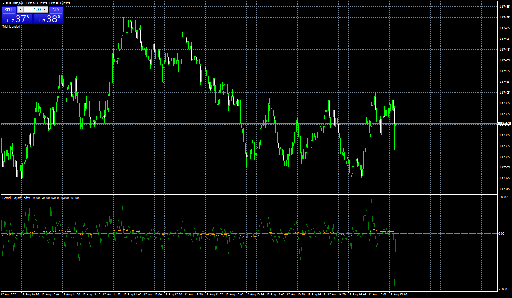

# Herrick_Payoff_Index

> Source: https://fxcodebase.com/code/viewtopic.php?f=38&t=71416  
> Forum: 38 · Topic 71416 · 4 post(s)

---

## Herrick_Payoff_Index

**Apprentice** · Thu Aug 12, 2021 7:22 am

Based on the request.
[https://fxcodebase.com/code/viewtopic.p ... 51#p142851](https://fxcodebase.com/code/viewtopic.php?f=38&p=142851#p142851)

 [Herrick_Payoff_Index.mq4](files/143198/Herrick_Payoff_Index.mq4)

 [Herrick_Payoff_Index.mq5](files/143198/Herrick_Payoff_Index.mq5)

---

## Re: Herrick_Payoff_Index

**AndrewOcconer** · Thu Aug 12, 2021 11:49 pm

Hello Apprentice
Can you convert this indicator to MT5 please?

---

## Re: Herrick_Payoff_Index

**Apprentice** · Fri Aug 13, 2021 7:59 am

Your request is added to the development list.
Development reference 744.

---

## Re: Herrick_Payoff_Index

**Apprentice** · Fri Aug 20, 2021 1:18 pm

Herrick_Payoff_Index.mq5 added.
