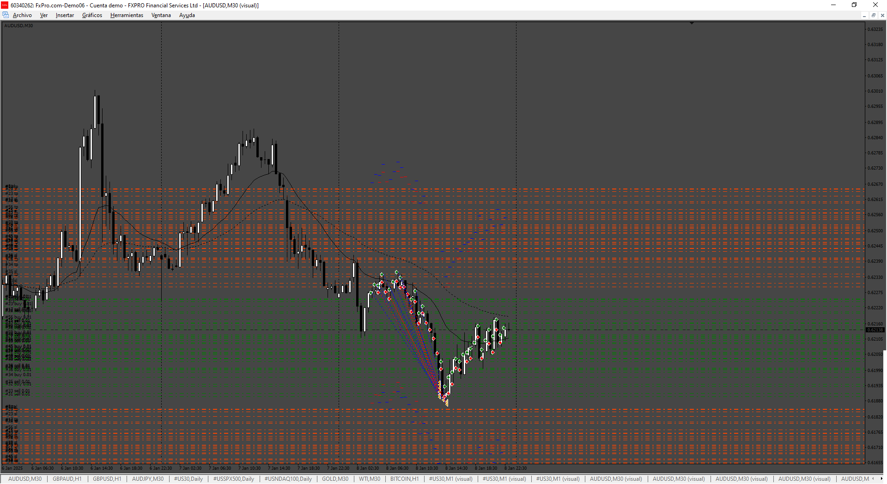

# HF_EA

> Source: https://fxcodebase.com/code/viewtopic.php?f=38&t=76091  
> Forum: 38 · Topic 76091 · 9 post(s)

---

## HF_EA

**Apprentice** · Fri Jun 27, 2025 4:00 am

Based on the request.
[https://fxcodebase.com/code/viewtopic.p ... 02#p159702](https://fxcodebase.com/code/viewtopic.php?f=27&p=159702#p159702)

 [HF_EA_v1.00.mq4](files/159757/HF_EA_v1.00.mq4)

 [HF_EA_v1.00.mq5](files/159757/HF_EA_v1.00.mq5)

---

## Re: HF_EA

**[email protected]** · Sat Jun 28, 2025 11:27 am

> **Apprentice wrote:**
>
>
> Snimka zaslona 2025-06-27 105932.png
>
>
> Based on the request.
> [https://fxcodebase.com/code/viewtopic.p ... 02#p159702](https://fxcodebase.com/code/viewtopic.php?f=27&p=159702#p159702)
>
>
> HF_EA_v1.00.mq4
>
>
>
>
> HF_EA_v1.00.mq5

Hi. Thanks for you great work.
Please add another option to EA ( for both MT4 and MT5 versions).
If a position is opened and after T1 second it is in profit, the EA closes it. Also, if a position is opened and after T2 seconds it is in loss, the robot closes it. The values ​​T1 and T2 are set by the trader at the input. option add as below:

Close Position Time : (on/off)
Waiting Time to close profitable positions in seconds: T1
Waiting time to close losing positions in seconds: T2

---

## Re: HF_EA

**Apprentice** · Wed Jul 02, 2025 2:41 pm

We have added your request to the development list.
Development reference 431

---

## Time intervals under one minute

**[email protected]** · Fri Jul 04, 2025 6:23 am

> **Apprentice wrote:**
>
>
> Snimka zaslona 2025-06-27 105932.png
>
>
> Based on the request.
> [https://fxcodebase.com/code/viewtopic.p ... 02#p159702](https://fxcodebase.com/code/viewtopic.php?f=27&p=159702#p159702)
>
>
> HF_EA_v1.00.mq4
>
>
>
>
> HF_EA_v1.00.mq5

Hello. Thanks for your work. I wrote this High Frequency expert trading idea for trading at specific times and executing trades under one minute, for example 10 seconds and 30 seconds. In back testing the expert opens positions under one minute, but in real and live trading as well as in demo account when I set time intervals under one minute, for example 10 or 30 seconds, the positions open at 60 second intervals. Please fix this problem for MT4 and MT5 versions.
Thanks in advance.

---

## Re: HF_EA

**Apprentice** · Sun Jul 06, 2025 2:43 am

We have added your request to the development list.
Development reference 443

---

## Re: HF_EA

**Apprentice** · Sun Jul 13, 2025 2:10 pm

[HF_EA_v1.10.mq4](files/159914/HF_EA_v1.10.mq4)

 [HF_EA_v1.10.mq5](files/159914/HF_EA_v1.10.mq5)

---

## Re: HF_EA

**[email protected]** · Tue Aug 05, 2025 4:42 pm

> **Apprentice wrote:**
>
>
> Snimka zaslona 2025-06-27 105932.png
>
>
> Based on the request.
> [https://fxcodebase.com/code/viewtopic.p ... 02#p159702](https://fxcodebase.com/code/viewtopic.php?f=27&p=159702#p159702)
>
>
> HF_EA_v1.00.mq4
>
>
>
>
> HF_EA_v1.00.mq5

Hi. thanks for your great work. I would like you to make a change and correction in version 1.00 of the EA. Instead of time intervals, price intervals in points and pips should be used in the EA. Please replace price intervals (Pip/Point) with time intervals in version 1.00 for MetaTrader 4 and 5. Thank you very much.

---

## Re: HF_EA

**Apprentice** · Sun Aug 10, 2025 5:16 am

We have added your request to the development list.
Development reference 510

---

## Re: HF_EA

**Apprentice** · Wed Aug 13, 2025 3:29 am

 [HF_EA_v2.00.mq4](files/160221/HF_EA_v2.00.mq4)
